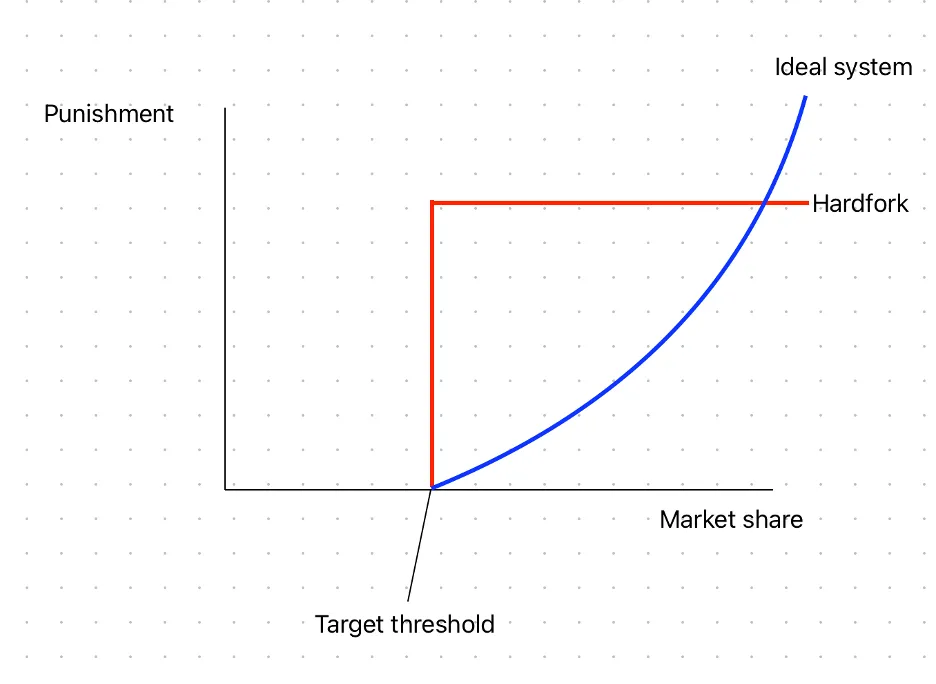
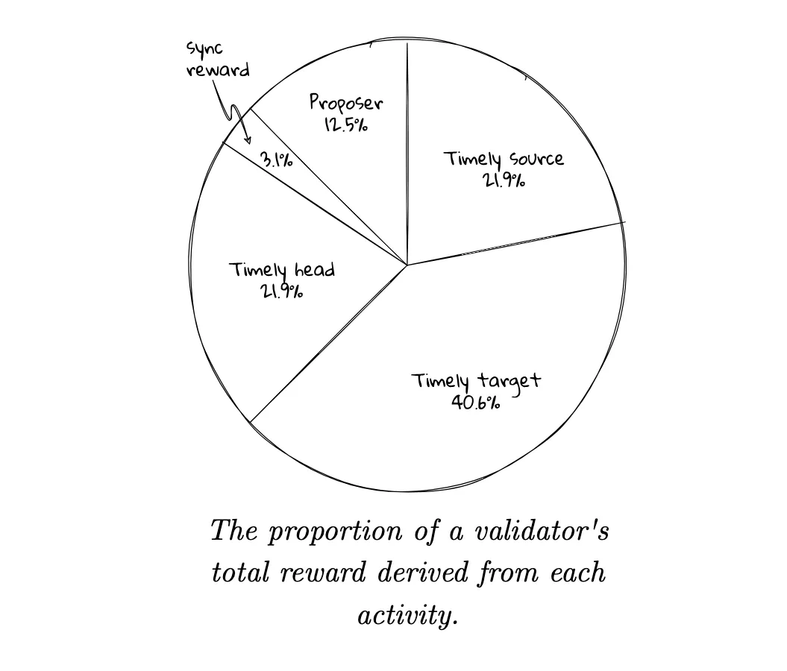
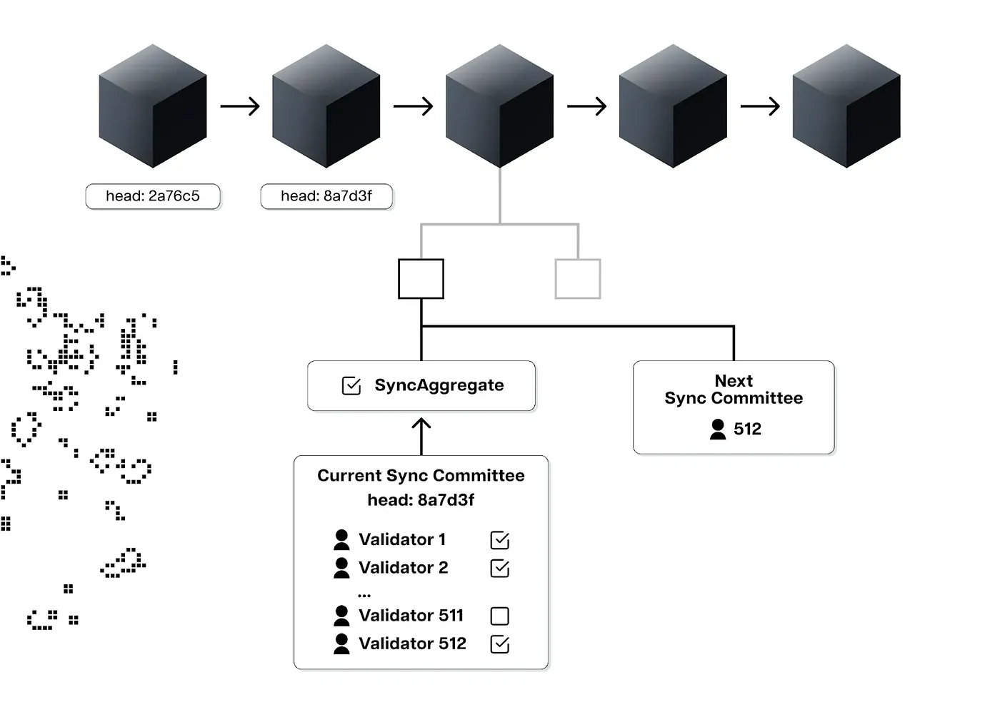
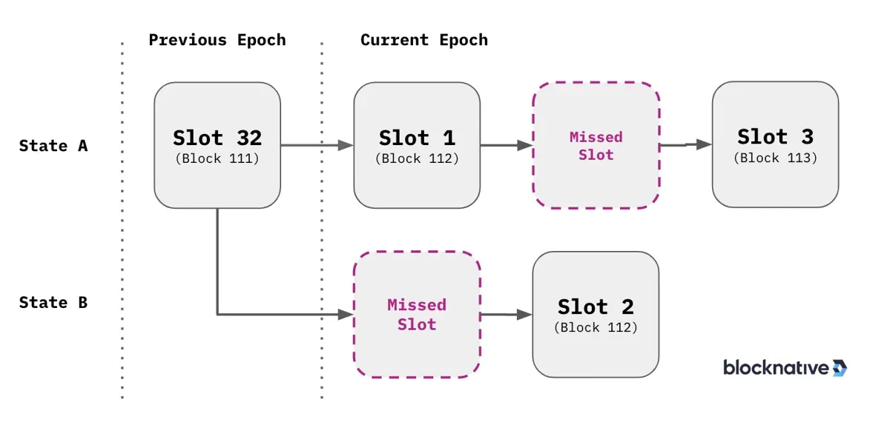

<h1>Proactive Slashing — what it would look like</h1>

<i>Note: this is the third of a series of four articles on the social slashing of systemic risks.</i>

Currently Ethereum is a censorship resistant, credibly neutral state execution machine. It processes transactions according to predefined rules that allow anyone to write smart contracts, or more simply escrow accounts with programmatic rules and state changes. With this capability though, one can write malicious contracts. Whether it’s terrorist financing, ponzi schemes, or non-compliant financial applications, Ethereum has always taken the path of neutrality; i.e. anything goes in the Turing complete sense of the phrase. This is an awesome thing too! Not being able to censor users based on religion, race, country of origin, or any belief or classification is a goal worth striving for. The problem we find ourselves in today however is answering the question of what happens when smart contracts are written in a way that threatens the censorship resistance or credible neutrality of the network. An example would be a system that incentivizes all validators on Ethereum to deposit their tokens to a centralized exchange, or a system that massively increases node hardware requirements (thus reducing decentralization). Should the system remain neutral to these centralizing market forces? If market forces drive 100% of validators to be owned by one entity, is the system still censorship resistant or credibly neutral? Is there any recourse for users that want a system not controlled by a handful of people? Does the network need to wait for an attack or censorship to act? What are our options?

    

This is the situation we find ourselves in. At the moment, one concentrated actor (CA) controls >31% of all staked ETH. This actor and others are poised to drive this number even higher over the coming years. Ethereum has a decision to make, and this article outlines the feasibility of various options should action ever want to be initiated.

From the mouth of the smarter folk

“33% of the staked ether is a benchmark for an attacker because with anything greater than this amount they have the ability to prevent the chain from finalizing without having to finely control the actions of the other validators.” — jmcook.eth [1,2]

<b>Proactive vs retroactive modern girls</b>

When considering a potential social action, there are two separate issues to think about:

    * a concentrated actor (CA) growing too big that they control the chain,
    * a concentrated actor performing some malicious attack (e.g. censoring, reorg, etc.).

Both would require similar actions on behalf of the community and client developer teams, however one could be done in a controlled fashion (the proactive slashing), whereas the latter would be a rushed bug fix of sorts (similar to the DAO fork, but potentially much messier).

Some may say that size or monopolistic attributions are not dangerous, but only the malicious behavior of these entities. Although true in an equilibrium state, attitudes or intentions can change very quickly and centralization tends to exacerbate this speed. To give an example, in May of 2022, if you would have said that 80% of nodes would censor tornado cash transactions, people would have called you crazy. But then that’s exactly what happened.[3] Decentralization is necessary because one doesn’t know how governments or even social attitudes can change.

The argument for proactive action mirrors the reasoning behind the paradox of credibly neutrality.[4] To quickly paraphrase, if a credibly neutral system is credibly neutral towards something threatening its own credible neutrality, then it will not stay credibly neutral. The argument against would say that by acting, the system proves its non-neutrality and thus invalidates itself.

Although proactive and retroactive choices would likely look similar in the code, for the sake of article, we’re going to assume that a proactive path is the way forward. Whether it is or not, the thought experiment and outlining of potential options will ready the community regardless of preferred option.

<b>Soft forking, Hard Forking and Ideal Path Construction</b>

When thinking about potential paths for forking a protocol, note that there are two ways of doing it, a soft fork and a hard fork. A soft fork is an opt-in model, whereas a hard fork requires coordination amongst the nodes and can result in slashing conditions for participating nodes should they go with the minority chain.

To give an example of each, a soft fork upgrade could be to have your validator ignore all messages sent by or to one address. Those wishing to interact with that address could always just go through another party, but if enough of the network start ignoring that address, it will be cumbersome for them to use the system. This is what happened with the censoring of tornado cash transactions.[5]

A hard fork on the other hand is a mandatory break in the system. The canonical example of this is the DAO fork, where funds were taken from one address and given to another. In the PoS world we now are in, this means that your validator must pick the correct chain to sign blocks on because you’ll be slashed if you sign on both. It’s extremely disruptive as anything can be done to the chain (e.g. double spends, reversals of transactions, etc.), however can be used for major upgrades (e.g. PoW to PoS) or decisive actions that need to be addressed (the DAO fork or a bug fix).

If the path forward for social action is to wait for a CA to misbehave, the likely recourse would be a hard fork. If however, the community chooses to act proactively, a soft fork is likely preferred as it is less disruptive, allows the community to voice their opinions in an opt-in manner, and allows the CA to address the situation without the need for punitive action.

<b>She’s a 10, but penalizes participating validators … what a good method looks like</b>

When looking to develop a method for deterring a CA, the options should address the problem in a manner relative to the size of the problem. What this means is that, like most punishments in the PoS system, the punishment is larger should the attack be bigger. For instance if you have a target threshold of 25% (max size of one validator entity), parties should begin to lose a very small amount once they hit 26%, a little more when they hit 30%, and then finally if they hit >50% or 60%, the punishments should be larger and more immediate to address the severity of the situation.

    

Remember too, that the goal is not to slash anyone, but rather to dissuade a CA from growing too large. For this, hard forks or one-time slashings are probably not as effective. Even besides the coordination needed, the one-time nature of the slashing would require more action for every threshold and provides little options of recourse to the growing CA (often for reasons outside of their control, e.g. other validators drop out).

Another ideal characteristic for any method is that participating validators should not be punished, or at least not more than the CA. If you lose out on $1 but the CA loses out on $7, it’s probably ok, but ideally you don’t lose out at all. Additionally if you risk being slashed by participating (e.g. the chain must choose between you or the CA), this is clearly a negative.

<b>devs wanted for hazardous journey — a subset of community options</b>

The following are listed in no particular order and should give a general overview of the good and bad options the community could potentially tap into.

In Ethereum PoS, validators have three jobs that pay money: proposing blocks, attesting to other validators’ blocks, and participating in the sync committee. Although the rewards vary greatly, a rough estimate I found is that you can expect:

    * Attestations: 0.0040–0.0042 ETH per day
    * Sync committee membership: ~0.08 per sync committee participation[6]
    * Proposing Blocks: 0.018–0.03 ETH per block

    

So let’s go after each:

<b>Ignore Attestations</b> — “The largest part, 84.4%, of validators’ rewards come from making attestations”.[7] For attestations, the way that PoS in Ethereum works is that validators are separated into committees for every epoch (32 blocks) and then there is a committee aggregator for each slot (block) in each epoch, who grabs attestations from the other validators in that committee. In theory, he can ignore attestations from our targeted CA, thus reducing their attestation rewards. This method is very viable, however participating validators would also reduce their own rewards, as the total rewards in the block are more if the total number of attestations is higher. Luckily the penalty to the CA is still greater (~7x) than the reduced rewards of the aggregator, but it would still hit participating validators.

<b>Ignore Committee Sync Messages</b> — The sync committee is a relatively newer spec where a group of 512 validators are selected ~daily (27 hours) and they sign off on blockheaders (similar to attestations). The purpose is for use in light client bridges. Although not the target of this article, note that some community members have critiqued the security of this model considering that they get rewarded ~.08 ETH per selection, but cannot be slashed.[8,9,10] Anyway, the idea for us would be for the block proposer to ignore sync committee messages from the CA, thus reducing their rewards and making them less competitive. As with attestations, block proposers are incentivized to include sync committee messages, so they would lose out on rewards, however at the rate again of ~1/7th the penalty of each sync committee member they exclude. Another downside is that the rewards are relatively small and might not be enough to force any real action (only ~3.1% of total rewards).

    

[11]

In epoch block reorganization — Lighthouse and Prysm had an issue a while back that had slower propagation of blocks in the first slot of an epoch. The interesting thing is that you could potentially use this tool to pretend that CA validators were slow to propagate, thus having small reorganizations take out CA blocks. Others have hinted at using (or maybe have used) this method for MEV extraction. The result would be increased orphaned blocks for the CA, thus reducing their MEV and proposer rewards. [12]

It is also less extreme than other options in the sense that only when the CA has a slot directly next to that of our proposer(e.g. they have a slot 2 and we have slot 1) would they be orphaned. Since it could be viewed as an “honest” mistake to the protocol, there would be no penalty to participating validators, but there could be issues for finality on the chain as a whole if there are several fork choices and a more even split of parties running vs not running the software. Note too that this attack could be more successful if we could identify CA actor nodes, which we could purposefully delay the message to (versus the whole network which could be riskier). Further note, this is a known attack on proposers, specifically that delaying sending messages can mess with their rewards.[13] Usually it’s to favor a specific party as the attack, but in our case, we just want to NOT favor the CA.

    

<b>Hard fork slashing</b> — This option is both the most obvious and the least desirable. A hard fork is what happened in the DAO. In the case of CA controlling a large set of validators, the nodes would agree to slash a selected group of validators down to a targeted threshold. Basically you could just delete their balance down to a desired point. It’s very hard to pull off since > 66% of nodes would need to be in perfect coordination to pull it off (to finalize, 51% else), something very unlikely given that the CA would likely control a large portion and have significant sway in the community. It’s also very risky, as a failed attempt at a fork would result in significant slashing for participating validators.

<b>Refuse new CA blocks</b> — The goal here is that all nodes refuse to accept blocks built by certain addresses until their level of control is reduced. Similar to a hard fork, you would need a majority of participating nodes in order to make this effective. The purpose of this attack is having a majority of nodes, simply not accept blocks proposed by the CA until their level of control is reduced (they withdraw or are inactivity leaked below the threshold). It would be less extreme than a hard fork in the sense that the CA could still remedy the situation themselves (versus an instant penalty or action), however this option has the major downside that it would cause penalties for participating validators if a majority do not run this client. The threshold to do this could be slightly less than a hard fork (just 50+% vs 66% to finalize a hard fork).

<b>Enshrining in the protocol</b> — An option thrown around by the Ethereum Foundation(EF) is that the base protocol could issue you an LST when you stake.[14] This option is great in the sense that you could set limits to the LST at a threshold (e.g. only 30% of validators can participate) and even curb rewards if it’s greater. The cosmos ecosystem has a similar mechanism which provides support and design for the idea.[15] A native LST could also gain support as the best option for use in other protocols since it would be looked at as the safest option.

This action would significantly hurt an LST providing CA, but the downside is that it fails to do much to address other non-LST systemic risks (are we going to enshrine everything? Does this actually fix the moral hazard of LST’s?). Restaking for instance would require a different enshrinement, and that doesn’t even block all restaking, as parties could create another contract with higher yield and even riskier validation tasks. Additionally, the risks of LST’s are still present and now internalized; the reason the EF and others have voiced opposition to them(in protocol or not). Overall, whack-a-mole by enshrining has limits, but the threat could help in the short term for LST’s and restaking in particular.[16]

<b>Contract Interaction Censorship</b> — Another obvious option is that you could just censor all contract calls to related CA addresses (similar to the tornado cash censoring). For example, you could censor all governance token transactions or even all LST token transactions. Not that this would get anyone below a threshold by itself, but it would make it painful and slower to interact with the CA’s system. As with most of these options, hopefully it would send a message and incentivize switching to other competitors. For an LST, a block proposer ignoring the blocks with interactions to the LST would be very destabilizing to lending protocols, stablecoins, and connected protocols. This opt-in approach is attractive for the reason that it doesn’t fully censor anyone (they can obviously build their own blocks), but rather just slows down their system. It’s also attractive in the sense that the code is already written (used by a majority of validators at a time censoring tornado cash), so the lift is relatively light. The big negative here is the narrative around censoring at the application level versus the consensus layer. That said, if the main retort of those against a social fork is “free markets always”, then that argument falls flat if applying the same “freedom” principle to the block proposer market.

<b>MEV censorship</b> — A current issue of centralization in the Ethereum ecosystem is around the centralization of MEV extraction in block building service providers(flashbots, bloXroute, etc.). Oversimplifying for brevity, these companies use private mempools with centralized (blacklist-able) API’s to find and extract MEV. As of writing this, over 20% of blocks use Flashbots and there are only a handful of competitors.[17] There are two routes here: these companies could refuse to submit transaction bundles to CA validators (essentially not allowing them to use flashbots or similar for block building), or they could censor transactions themselves (e.g. the previous solution). The former option would likely just push them to competitors, but a threat in and of itself might be enough to push a change, especially with some coordination here. Additionally, the latter option would be near devastating for the CA as they would lose out on access to a large number of blocks and the usability of their LST would plummet. This approach is rather clean, but the downside is that a handful of entities can essentially blacklist a large portion of the validators and the meme around that wouldn’t be great for the ecosystem.[18] I personally think the MEV cartels aren’t interested in this kind of censorship, but would bet an effort by restaking or LST services to get into block building would get them moving.[19]

<b>Vampire attacks and other market mechanisms</b> –This is the “do nothing” approach. The basic idea is that market forces will work out and we can help them by creating “vampire attacks”, or clones of the CA with governance rewards to distribute validator shares. The problem is that this falls flat everywhere but an economics textbook. As I went over in my second article, the natural monopoly tendencies of an LST, once it hits a certain threshold, are hard to overcome. Not to mention that this works only temporarily. Governance tokens, yield farming, token ponzis… they’re not an actual solution but a minor speed bump to the centralization of these protocols. You see this in tradfi and other businesses all around the world. Once cartels and monopolies form, you need strong social or regulatory action to dismantle them. I have faith that this can help while we get stuff in production, but we cannot rely on that which we know will fail.

<b>The curse of the blackened eye — the problem with restaking</b>

Knowing these options, we also have to think about potential systemic risks from non-validators, specifically restaking protocols. For non-identified validators and other protocols that pose threats to consensus, the only option is censorship at the application level. As said above, this is a much less favored approach as it introduces censorship of applications rather than validators at the consensus level.

If it was possible to identify restaking validators, you could use other options discussed above, however for more centralized LST or restaking services, such a luxury will likely be unavailable. The only potential solution will be node level censorship (don’t process their governance or liquid restaking token transactions) or even more subjectively, have a mechanism for attacking protocols using the system (e.g. censor a bridge or rollup if it uses restaking… also not ideal and too subjective).

<b>Give someone enough rope…</b>

Let’s be honest, none of these options are preferred. In a perfect world, you’d see protocols self-limiting and the promise of more yield would not tempt sound systems to adopt extra risk at the detriment of the parent system. But here we are.

The main downfall of implementing or even discussing these options is not that we might betray some mythical allegiance to the free market or “code is law” dogma, it’s that we’ll be building censorship tools that may one day be used against us. For those reasons, any use of these options should be a community decision that moves responsibly and infrequently. If these options were ever used to attack the system, they could and should be subject to social pressure themselves.

Of course it’s confusing. It’s not programmatic, and it’s hard to coordinate. But if we want a system that avoids capture by cartels or market forces, the social backstop must stay vigilant.

<b>Only inward from here</b>

The next article will focus on the implementations of feasible options into client software as well as nuances and numbers regarding the adoption level we’d need to hit to make some meaningful differences.

Long term it’s a discussion we need to have a space. Are you aligned with the “market” (whatever that is) or can we have different goals? How do you regulate the excesses of a market system (speculative fervor, ignorance of systemic risks, excess leverage, hacks, etc.) in a meaningful way that also preserves credible neutrality toward some goal. Are the validators the regulators? Are the nodes the regulators? Have we lost everything if we add in “decentralized” regulators? I don’t know. It’s clearly a failure of the system designed when this happens, and hopefully this starts a long discussion on the proper role of the social layer and the need (or lack of need) for subjective controls.

<b>Footnotes</b>

Sidenote to the EF guys — to kill off most of these discouragement attacks, the proposer / validator split for rewards should just be 50/50. 1/8 vs 7/8 introduces a lot of problems in hyper competitive environments. Granted we want to use that issue here, but could be a real attack vector in a cartelized LST/ restaking world, reducing security across the board.

[1]https://mirror.xyz/jmcook.eth/YqHargbVWVNRQqQpVpzrqEQ8IqwNUJDIpwRP7SS5FXs

[2] Note, the second article in this series goes into the thresholds and risks of certain consensus level threats.

[3] https://www.coindesk.com/tech/2022/08/17/tornado-cash-fallout-can-ethereum-be-censored/

[4]Stolen admittedly from Popper’s paradox of tolerance, https://en.wikipedia.org/wiki/Paradox_of_tolerance

[5] https://tokeninsight.medium.com/from-tornado-cash-sanction-to-ethereum-say-no-to-censorship-at-the-blockchain-level-431ccde0aef0#:~:text=On%20August%208%2C%20OFAC%20added,from%20these%20smart%20contract%20addresses

[6] https://hackmd.io/@sproul/altair-rewards

[7]https://eth2book.info/capella/part2/consensus/lmd_ghost/

[8] https://hackmd.io/@sproul/altair-rewards

[9]https://prestwich.substack.com/p/altair

[10]https://github.com/ethereum/consensus-specs/issues/3321

[11]https://www.nervos.org/knowledge-base/ultimate_guide_to_light_clients

[12] https://www.blocknative.com/blog/missed-slots-and-late-block-reorgs-ethereum

[13] https://ethresear.ch/t/change-fork-choice-rule-to-mitigate-balancing-and-reorging-attacks/11127/3

[14] https://mirror.xyz/barnabe.eth/v7W2CsSVYW6I_9bbHFDqvqShQ6gTX3weAtwkaVAzAL4

[15] https://blog.stakeflow.io/liquid-staking-module-of-the-cosmos-hub-a1e662128577

[16] We can sort of be honest, we don’t want any LST’s. The only reason we tolerate them is that when they’re small, it’s not (too) concerning

[17]https://www.theblock.co/data/on-chain-metrics/ethereum/percentage-of-blocks-proposed-by-mev-boost-relay

[18] We’ll leave it to other people to fight the MEV cartels. This centralization is a known problem in Ethereum, but I think we’re all just waiting for L2’s to steal all activity but DA so it becomes their problem and not Ethereum’s (note it’s also not my favored approach, but one thing at a time).

[19] A good thing, since PBS is important
