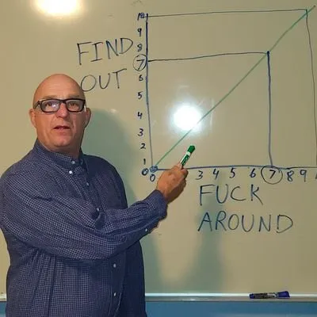
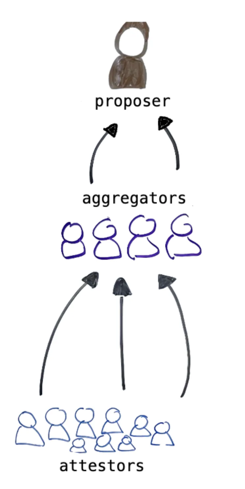
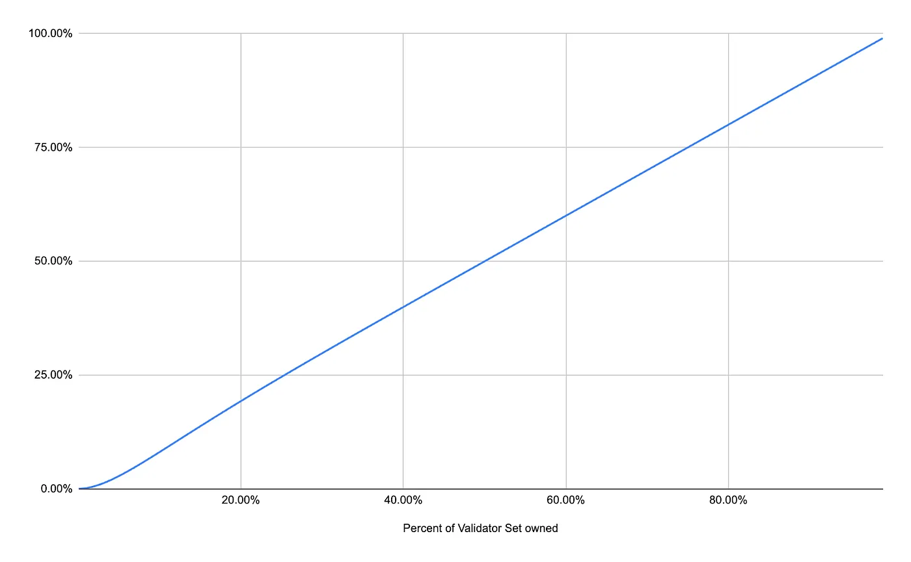
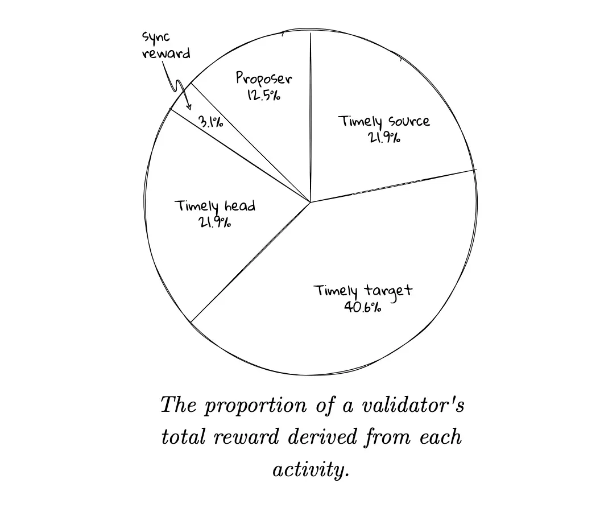

<h1>addressing systemic risks — discouragement attacks against centralized validator sets</h1>

<i>Note: this is the fourth of a series of articles on social slashing of systemic risks.</i>

Given the theoretical paths outlined in the third article, this piece focuses on a novel discouragement attack which can reduce attestation and sync committee rewards of a targeted actor. This attack can theoretically be used to reduce a concentrated actor’s attestation and sync committee participation and reduces their rewards almost directly proportional to the number of validators participating in the attack.

Of the options looked at, this solution was the one with the highest likelihood to achieve a finalized chain state with the following properties:

    * reduced concentrated actor(CA) validator share
    * reduced CA rewards
    * minimal/nonexistent penalty to participating validators
    * still Ethereum (aka not a minority fork)
    * Included throughout are references and more resources are added at the bottom of the article if you want to join us down the rabbit hole.

    

<b>back to the start — identifying validators</b>

The first step to targeting a validator is figuring out how to identify them. Ethereum PoS validators are not identified by address but by validator index. So rather than target validators set by public key, we must map their address to a valid Index. Since every validator is assigned a validator index upon depositing, we can create a map of validator indices by looking at deposit events in the beacon contract.[1]

Note that for some CA’s, finding their addresses may be difficult (e.g. a list of validators run by a CEX). Fortunately though, LST’s and restaking protocols are much more transparent in their inner workings, so the indices are relatively easy to gather. Also note that LST’s could simply upgrade to obfuscate this or hide; but this isn’t actually too bad. An LST or CEX that has the ability to hide from the social layer is also hiding from would-be regulators or attackers looking to bribe/influence the party.

A simple example script for finding Lido validator indexes (as of Feb 2024) can be found here.

<b>midwest discouragement attacks</b>

    

“Every slot a new committee becomes active and is expected to provide attestations. 440k validators / 64 committees = ~17k validators/committee. 17k validators poses a problem; it’s both too much network chatter and too many signatures to aggregate all at once. Fortunately, we’ve already split committees into 64 subnets. Each subnet consists of ~250 validators, of which 16 are designated as aggregators. As validators review blocks, they broadcast their attestations to their subnet. All 16 aggregators are attempting to build the same aggregate signatures, but network conditions often make perfection possible.”[2]

Validators send attestations to committee subnet aggregators who then create an aggregated attestation that will be included in each block. To explain further, validators are partitioned into committees in each epoch, with one committee per slot. In each slot, one validator from the designated committee proposes a block. Then, all the members of that committee will attest to the newly proposed block and its position in the chain. [3] The goal of our modification is to make it so that when our validators are the subnet committee aggregators, they ignore CA attestations. Couple this with a selection rule that says when we are proposer, we only choose the aggregation that does not include CA validator attestations.

<b>more background</b>

There is a substantial overhead associated with passing attestation data around the network for every validator. Therefore, the attestations from individual validators are aggregated within subnets before being broadcast more widely.[4]

During epochs where we have participating validators as the proposer AND aggregator, we can exclude a portion of attestations from CA validators in our blacklist set. Participating proposer clients will be modified such that rather than selecting the aggregation with the most attestations, they will choose the one with the most attestations and no CA attestations (a list of validator indices created from our participating aggregator). The probability for a given committee of having at least one of the aggregators and the proposer is as follows:

    

A nice feature of this discouragement attack is that it scales almost identically with validator participation. What this means is that if you get 20% of the validators participating, you should be able to reduce CA attestation rewards by about 20%.[5]

The downside for proposers here is that they would lose out on some attestation rewards as ⅛ of an attestation reward goes to the proposer. There is an argument to be made that participating validators will be open to losing this small amount as the CA (competing validators) will lose 7x the amount they amount will, thus making themselves more competitive and protecting the chain from centralization.

The case where we have only the proposer (and no aggregator in a given committee) was also looked at. A participating validator could drop all aggregations with CA signatures (so have no attestations for a given committee), but then you would punish non-CA validators as well as CA validators if they were in the same subcommittee. Not to mention, the participating validator would lose more rewards, rewards which would not be offset necessarily by a decreased CA reward. For these reasons, this action is something that we will avoid, however we will need to look further into how to best include/exclude if target CA lists do match up perfectly (e.g. if you drop one honest validator is it ok if you’re still dropping 20 CA indices?).

<b>aftermath for our therapist</b>

consequences to the CA: Missing an attestation means missing rewards, about 84.4% of base rewards to be specific (see here for the exact rewards structure). Depending on block space, they could try to get attached to subsequent blocks for partial rewards, but from my understanding, it rarely happens and they would likely lose out on most attestation rewards as laid out in the analysis.

    

Overall, any significant percentage of validators participating could be devastating to the CA with regard to staking competitively.

consequences to participating validators: Committee aggregators and proposers are incentivized to include as many valid attestations as they can see in their Aggregated Attestation. For every attestation the aggregator excludes, the reward decreases (see Rewards scale with participation). In general, the rule for ETH2.0 is that “7/8 of rewards go to validators performing duties and 1/8 to the proposers including the evidence in blocks.” The aggregator and proposer both therefore would lose out like all ETH validators in the sense that total attestation rewards scale with participation as well, but there would be no direct punishment that would make the aggregator less competitive.[6,7]

consequences to the protocol: Of all discouragement attack options analyzed, excluding a limited number of attestations from certain parties seems to be the option with the lightest footprint. More research should be done on how this could affect fork-choice-rule, however theoretically it shouldn’t affect it (all else equal). One consideration to note is relative to the size of the CA. If the CA is >33% of the validator set, you cannot ignore all their attestations, as it would affect block finality. Therefore you would need to limit the number of attestations ignored to only those greater than some threshold for finality.

<b>ousing the beacon — ignore sync committee messages</b>

In addition to attestations, we can reduce up to another 3.1% of CA rewards by doing a similar aggregation censoring in the sync committee. To briefly explain, Validators are rewarded for correctly participating in sync committee signatures (each day, 512 are chosen, so very rare), which are of use to light clients. This option may even be a preferable first step versus the attestation censorship, as the sync committee is not part of internal fork choice or even required for the main protocol at all.

The same “rewards scale with participation” concept is present here, however the big difference is that we have no issues with finality, forks, or even chain issues at all, as the sync committee is for use in other protocols and not within Ethereum. That said, several light client bridge implementations take advantage of the sync committee to finalize transactions and would be affected if a large portion of the sync committee is owned by the blacklisted CA. Overall though, it seems a relatively light touch on the system, but the big downside is that the rewards here are relatively small and may not be enough to deter a CA. It might be useful to try out as a first step in testing support/ implementation issues.

<b>the journey is just beginning</b>

I’m not proposing starting to censor a CA immediately. Other options should still be on table for addressing systemic risks, however this should be a great starting place for continuing discussions with stakeholders and developers in the Ethereum ecosystem as to the best path forward. We remain optimistic that just talking publicly about these options can be enough to deter a CA from growing any larger or maintaining threatening levels of control. Remaining in a ready state with regard to actions to stem threats is vital for a secure ecosystem. From here I’ll be working with various groups to test the code to get it production ready, address concerns as they come up, and then write further articles on the best strategy for implementation.

If you’re interested in joining us to test various code changes or just to protest, please reach out or join this telegram group.

<b>references</b>

    [1] https://github.com/ethereum/annotated-spec/blob/master/phase0/beacon-chain.md
    [2] Proof of Stake | Inevitable Ethereum
    [3] https://arxiv.org/pdf/2003.03052.pdf 1
    [4] Attestations | ethereum.org
    [5] Aggregator selection — Google Sheets
    [6]Upgrading Ethereum | 2.8.4 Rewards
    [7] Upgrading Ethereum | 3.5.3 Block processing

<b>further reading</b>

    * Vitalik’s Discouragement attacks: https://github.com/ethereum/research/blob/master/papers/discouragement/discouragement.pdf
    * Aggregation process:
https://github.com/ethereum/consensus-specs/blob/dev/specs/phase0/validator.md#construct-aggregate
    * https://ethereum.org/en/developers/docs/consensus-mechanisms/pos/attestations/#aggregated-attestation
    * https://notes.ethereum.org/@hww/aggregation
    * Sync protocol spec: https://github.com/ethereum/consensus-specs/blob/dev/specs/altair/light-client/sync-protocol.md
    * Rewards: https://eth2book.info/capella/part2/incentives/rewards/
    * Gasper paper: https://arxiv.org/pdf/2003.03052.pdf
    * Understanding the fork choice rule
    * Inactivity Leak: https://notes.ethereum.org/@vbuterin/serenity_design_rationale?type=view#Inactivity-leak
    * Ethereum PoS Attack and Defense: https://mirror.xyz/jmcook.eth/YqHargbVWVNRQqQpVpzrqEQ8IqwNUJDIpwRP7SS5FXs
    * Shout to Banteg for ideas: https://twitter.com/bantg/status/1561177300741283842
    * Proof-of-Stake overview: https://ethereum.org/en/developers/docs/consensus-mechanisms/pos/
    * Vitalik on Lex Friedman on the Social Layer: https://www.youtube.com/watch?v=3yrqBG-7EVE
    * Can nodes go against the protocol: https://hackmd.io/@prysmaticlabs/finality#Can-nodes-go-against-the-protocol
    * Consensus and Execution client connections: https://ethereum.org/en/developers/docs/networking-layer/#connecting-clients
    * Mitigating attacks in PoS https://ethresear.ch/t/change-fork-choice-rule-to-mitigate-balancing-and-reorging-attacks/11127
    * Cool Epoch and Slot Visualization: https://beaconcha.in/charts/slotviz
    * Censorship in the PBS Stack: https://www.youtube.com/watch?v=WcJlseuhbX8