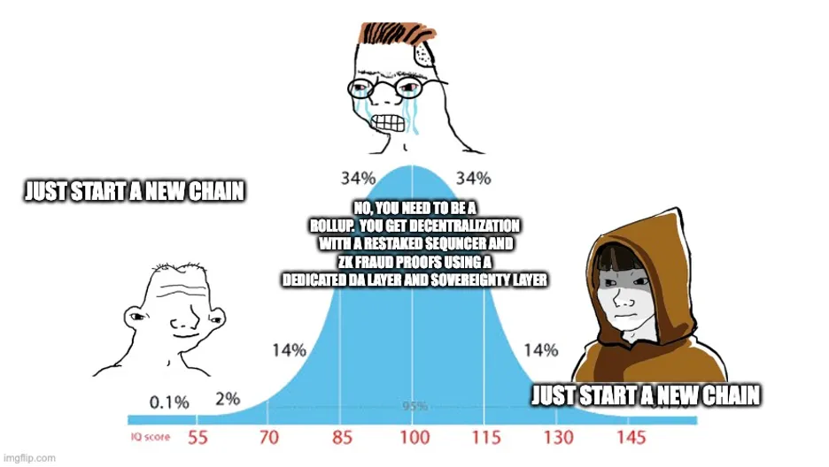

<h1>the cynics case against rollups</h1>

A lot of hype has been going on over the past few years w/ regards to rollups, so just thought I’d give my take on some of it. I think for my tldr, rollups have been oversold as a scaling solution and, while useful and not going anywhere, will likely see less popularity going forward as people realize the cost, the actual trade-offs, and the fact that bridging infrastructure in general becomes more trustless.

<b>what are rollups?</b>

This article is fairly technical, so I’m guessing you already know, but for us to get our terms set, let’s use the one from coindesk:

  <ul>Rollups process transactions on another, faster blockchain (known as a layer 2), then port the transaction data back to the parent blockchain (the layer 1 or mainnet) at a fraction of the price. This means that users can benefit from the speed and cheapness of the rollup while also benefiting from the security of the bigger blockchain.
  </ul>
  
It sounds simple, but there’s a lot here. For me, I came upon rollups after a history of seeing sidechains, state channels, merge mining, and plasma all sort of fail to materialize. So for me at least, this isn’t the first thing that made sense on the surface but once we actually build the thing, you find some unpalatable trade-offs.

I think the problem for rollups is actually less technical than the other failures though and just more of a problem of how we’ve been branding them. Rather than that nice definition above, I’ve found that most people think of something like “smart contract state-channels” when they say rollups (cough, cough “inherited security”), and in reality, you just have a separate L1 with a very nice light client bridge to the base L1, usually with some exit mechanism for L1 assets.

    

<b>what is the goal of a rollup?</b>

The real goal of a rollup is tough because of the various definitions. Is it a scaling solution? Is it a new chain or the same one expanded? Whose (if any) social consensus matters?

For me, I’m fine taking away the nuances between them and saying that what we’re looking for is the same thing we’ve always been looking for in the space, scalable censorship resistance. Namely the ability to make something (e.g. a company or an app) that can’t be overtaken or censored by someone like a government or large corporation.

But there’s a huge tradeoff between censorship resistance and actual utility. You can have censorship resistance with zk proofs and pure cryptography on top of btc or ETH, but monolithic ecosystems are far less robust and in addition you lose a lot of scalability, flexibility, and any ability to upgrade it or exert social consensus (aka sovereignty) over your system. This may not be a problem for the marginal user porting assets there for the next week, but in the context of financial assets, governance systems, or other market based games we’re building, these systems can be (and will be) captured. What we do when it comes down to social decisions and how we handle social consensus gracefully is ultimately to decide how useful and revolutionary these systems actually are.

For those that balk at the mention of the social layer, social consensus bounds even traditional systems. To give an example of sovereignty and why it’s important, let’s look at water. Imagine someone legally obtained all the water in the world; think like an Elon Bezos who just gets rich and buys up all the water rights, rivers, and/or land they source from. Now in a “censorship resistant” system, he can charge monopolistic rents and extract a heavy premium while we all scrounge for other solutions (desalination, super deep wells, etc.). But this isn’t ideal. For the 99.9% of the population, the best solution is to just take him out back, beat the shit out of him, and tell him he now owns 0 water (or vote it away from him in court…that too could work). Collectively we’d all be better off and we’d essentially do a social fork of property rights. Of course you wouldn’t want to do this all the time, or you lose the benefits of strong property rights and legality, but in this and other extreme cases, making this a possibility is what enables the country to persevere without the necessity of a full scale revolution (e.g. throw out the whole government to update this one property record). Even democracy and property rights are only as secure as the people’s unwillingness to revolt against a change, and building in mechanisms for acute social changes is critical in both democracy and cryptographic systems.

So if you want sovereignty, you have to build in a way for change. This is the constant tradeoff in government. You want to enable change, but just not fast enough that those changing things can use it to censor people themselves. The reason you value “decentralization” isn’t that you give up your ability to have social consensus, it’s that you hope the spectrum is large enough that one person can’t “socially” fork everyone else and on the other end, one person (or small group) can’t censor anyone out. It’s redefining that balance between social consensus and immutability, but on our own terms.

<b>rollups and forkability</b>

So I thought we were talking about rollups?

Rollups have a choice, remove forking or not. Either you back stop it at the social consensus level or you leave it as a piece of code (e.g. a smart contract bridge to the DA layer). For those that say “we’ll have the best of both worlds”, we’ll have token governance over the sovereignty and a base sequencer for decentralization…I don’t think it is nearly as special as you think. The scaling benefits you get are miniscule and the cost overhead is massive. This and it’s all for a system where you still have to deal with consensus in the worst way possible….token governance.

The other option is to remove upgradeability. This can work for temporary projects, opt-in systems where people will use them for a year or two until something better comes along. In fact I like this model a lot for most defi things (e.g. uniswap or an exchange doesn’t need to last forever and can survive via forks). But unfortunately there are trade offs here too. By sacrificing your own social consensus for someone else’s (hopefully a neutral third party), you run into several problems:

  1) if you get to be a large portion of their network you inherit their social consensus,
  2) if the DA layer gets captured you have no recourse,
  3) the DA fees have to be paid by someone and fee models might be harsh for hyper-competitive protocols

This is all without mentioning that community ownership isn’t a bad thing. Sure ETH is great, but we all have different views on things like income distributions, terrorist use of funds, and validator decentralization. Having the ability to define those conditions is powerful.

<b>so what are the benefits of a rollup?</b>

The main benefits of a rollup are exactly what they posit to be:

  - Trustless bridge (mostly)
  - Ability to bootstrap some security for your chain

Both of these things sound amazing. A trustless bridge to ETH and some additional security? But let’s dig into each claim.

Bridges are only trustless if there’s no upgradeability. Native assets also don’t matter here. But more on the bridge piece later.

For bootstrapping, it just comes at a cost. You have to pay the DA layer. The one question I think we haven’t answered though is how you’re paying for this? Ideally you have txn fees to pay for DA, but if you’re bootstrapping you don’t have those. So where is it coming from….VC’s?

So now you’re just paying gas costs for a chain no one uses and hoping it flips at some point. The cool thing about a traditional L1 is that if txn fees go up, payments to validators goes up, and your security goes up. It’s a nice little loop. But here, if your txn fees go up, the sequencer just pockets the difference; security doesn’t increase.

This “who gets the fee” is also important to note.

One of the main benefits of an L1 is that it almost requires your own token. If you have a PoS network, then the validators are people holding your token. There’s a long term vested interest in them seeing the project succeed. In a rollup, it can be more extractive. When fees are paid on a rollup, they go to pay for two things a) the L1 settlement/ DA costs and b) to the sequencer for block inclusion (blocks can fill up here too). But with a rollup, you don’t have a staking network (most of the time). The fee goes right to a (likely) centralized sequencer. So you have a DA layer you’re renting security from and then a sequencer you pay for inclusion. This is fine, but if you have a community and claim any sovereignty, the alternative (of building an L1) might be a little more attractive in creating a network of people who care and are rewarded properly for seeing the protocol through. If there is no DA layer fee and all inclusion fees are distributed amongst staked parties (of your token), you create a network. You buy the place and own it rather than rent it.

Sure, if you’re launching a system without a token, this can make sense, but so far blockchains are really good at using speculative buyers to bootstrap crypto-economic systems and I don’t see that going away any time soon.

<b>will anyone use rollups?</b>

Definitely. I think trustless bridges to ETH are still a huge thing (though likely to get less popular as ETH gets more expensive) and people already do have VC money, so it’s not a bad approach if the DA layer is affordable and especially if zk proofs take off to the point that its super cheap and only needs updated once a day.

But I see them as steps. The first use case is that they should be seen as a scaling tool for an extension of standalone smart contracts. A rollup that’s non-upgradeable, solely used for bridged assets, and has exit mechanisms even for assets in smart contracts (e.g. a uniswap or perp exchange could be on a rollup pretty easily). These will take off and should be started by people who want to see ETH succeed as a monolith.

The second area they can help with is some credibility early on. If you don’t have a robust decentralized network and want to give people some assurances (even if you do have upgradeability), posting your chain’s data to a bigger chain can make sense, especially in the case that you’re looking to get assets bridged to your chain. I do hope people stop using bridges (just lock the value and use native assets, but that’s an article for another time), but in the meantime, trusting early L1’s is a risky bet, so rollups can help these new chains gain access to a network of assets. For this latter stage though, I see rollups being an intermediate step. Eventually I’d expect the chain to upgrade the rollup contract to a light client bridge and then just have the L1 separate once it gets big enough. The big tradeoff here that user’s need to consider though is whether this period of bootstrapping and paying a DA layer hinders the growth of their own decentralized network. Imagine an alternative bootstrapping approach where one uses the VC money that would be used to pay the DA layer instead as rewards to validators of a base L1. After a year of costs, which one is better off? Tough to say, and likely depends on the hesitancy of assets to use a non-rollup bridge.

<b>rollups as bridges</b>

Many people say that rollups are just bridges; basically just a light client bridge with exit mechanisms built in. In this sense, yes “rollups” will continue and may be a popular option to reduce trust.

The big problem of course is, what sovereignty is given up for this trustless bridge? If the bridge has perfect exit mechanisms (and no upgradeability of course), and you can unwind smart contracts, force transactions, etc., then you have no sovereignty unless you’re willing to just hard fork away all the assets in the bridge.

And to be fair to rollups, sovereignty is more complicated than just the set up. As other sharper minds have noted, if USDC can choose the fork, you’re likely not a sovereign (or at least much less) chain. Power dynamics in these systems are complicated and enshrined bridges are just one way that you signal a reduction in your own sovereignty for the sake of minimizing trust (so as to secure bridged assets in this case).

My concluding thought on the bridges is that rollups as bridges are likely only a thing for the near term. As light client bridges get better, and bridging in general becomes less of a centralized crap shoot, we’ll actually have less concern trusting most of these bridges and you can start to think of chains (other L1’s) as you would just new smart contracts. Sure there’s social risk, code risk, and the like, but the general deposit mechanism works fine and doesn’t introduce any new trust assumptions (e.g. similar to how IBC or XCM works now, but more agnostic to ecosystem).

<b>current state of rollups</b>

I have to throw this in here because right now it’s pretty much a shame. Almost all of the rollups are just centralized layers that post things to a blockchain almost for the hell of it. No fraud proofs, centralized sequencers, admin keys for upgradeability, no forced transactions, and this is all even without taking complexity risk (especially of all the zk stuff) into account. As of now, rollups are promising, but true decentralized rollups are just small PoC’s at this point.

Like everything in this article, it’s not that I’m not bullish on them, it’s just that they’ve been oversold and we’re nowhere near where we need to be for game time (aka an actual adversarial attack / censoring campaign).

<b>conclusion</b>

So lots of pieces here. I think rollups are cool, but likely hyped too much as a scaling solution and I’ll state now that I think “sovereign rollups” are an oxymoron.

Whether to use a rollup depends on:

  - Is it just bridged assets?
  - Amount of bridged vs native assets
  - Will assets come w/o a rollup bridge?
  - Do you want a community? What layer do you want that community at?
  - Is capture a concern? Do you want to be able to fork/upgrade without changing addresses? Forever?
  - How much money do you have to bootstrap it? If ETH fees are 10k per transaction do you have a plan?

**Disclaimer — Maybe I just spent 6 pages telling you why I don’t know shit about rollups. I would love to be proven wrong here and maybe they are magic. So please check back in 6 months and see if I still feel this way. A lot of smart people I respect love these things, so definitely reserving the right to change my mind.
