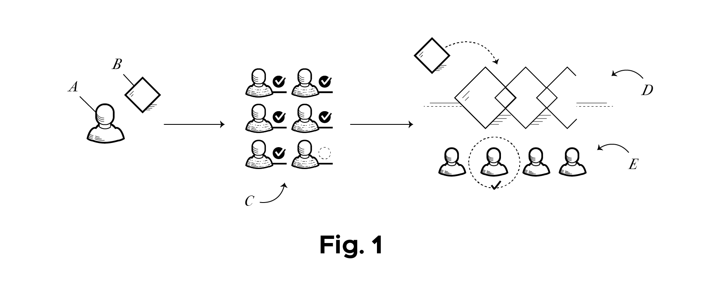
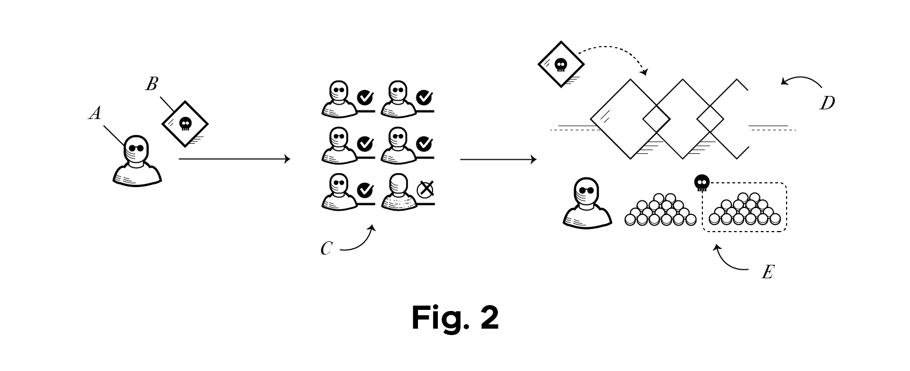
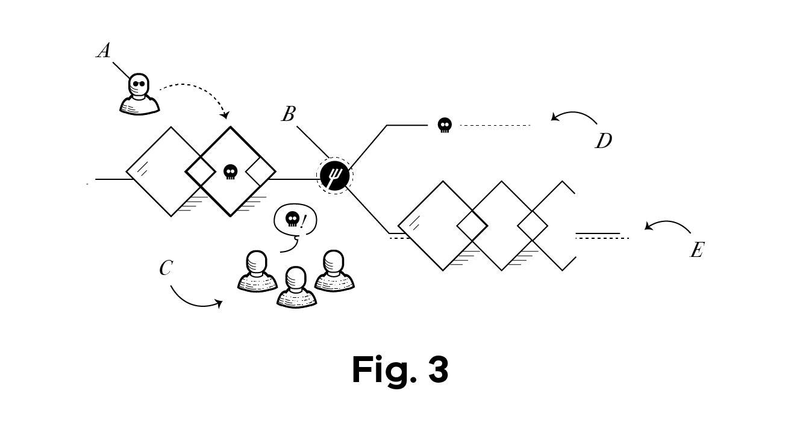
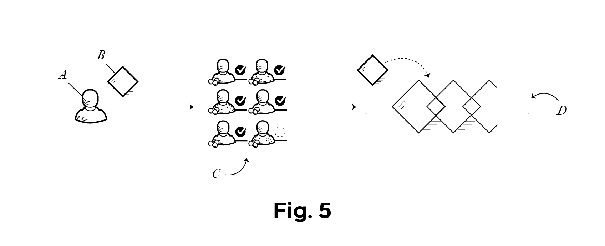
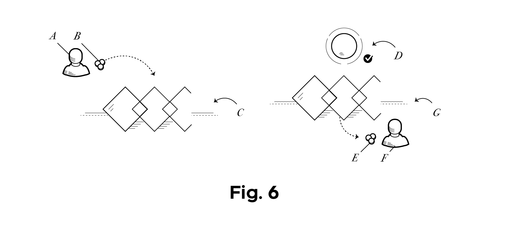
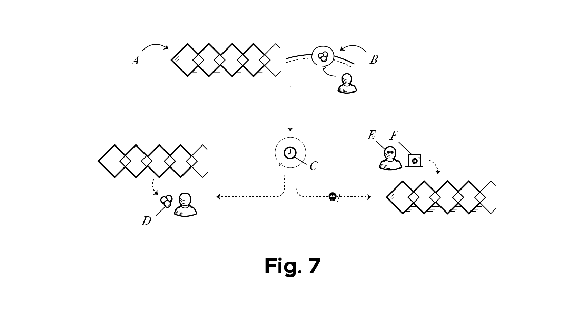
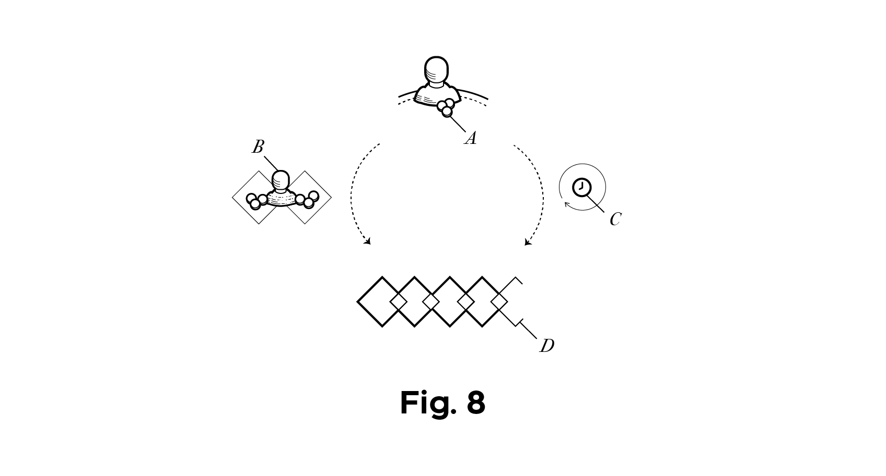
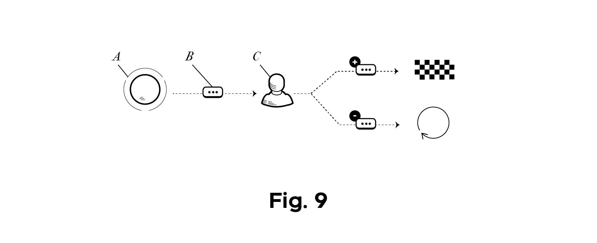

<h1> Oracles need social layers</h1>

Originally posted on X:  https://x.com/themandalore9/status/1828468971827327482

Imagine you have a blockchain.  PoS.  Validators stake tokens and they get to take turns proposing blocks while everyone else attests to the block’s validity.  If >2⁄3 of validators sign off on it, the block is considered final.

    

    [The Normal PoS Chain - A proposer (A) creates a block (B) that is validated by attestors (C) and is added to the blockchain (D).  A new proposer (E) is selected]

It looks from a quick glance that the system is secure up to 2/3 of the validator set being compromised.  If someone bought up or bribed 2/3 of tokens, they could break the system and double spend ... right?

    

    [The Bad Actor - a bad actor(A) submits a bad block (B).  He controls the majority of validators (C)  and takes over chain(D), taking all the funds (E)]

Wrong.

The system would just fork.

All blockchains have a social layer to fall back on. Honest users would simply slash that malicious actors' tokens, remove the double spend block and continue as if he never existed.  This ability is actually what secures all blockchains.

    

    [Falling Back to the Social Layer - A malicious proposer(A) submits a bad block.  A fork (B) is initiated. The honest users (C) go on the fork without the bad actor (E), leaving him alone on his malicious fork (D). ]

In case you didn’t know, honest majority assumptions are bad.  They give you a specific number of tokens you need to buy up for an attack.  If there’s a dollar amount to those tokens, your system can’t secure more than that amount (and this is even with bribes aside).
But in reality we never see these attacks.

Thanks to the fallback option of the social layer, an attacker would never get away with it.  The question you should ask yourself now is… well then why have any stake at all?  Why not just use the social layer?

To answer, let’s try out the two extreme options:

  * Option a) - Have no stake and anyone can propose
  * Option b) - Just have a centralized system and use the social layer to fork if they misbehave
  
For option a, you have a sybil/ ddos problem.  If anyone can propose, you have an issue with interoperability as you need some way to see what is the agreed upon truth.  If you don’t need a global consensus, this can actually work in some fashion, but if you want to see what everyone else is thinking, this method is rather inefficient and spam/ordering can get out of control.  You need to handle for someone with a giant data center spinning up millions of nodes and just making it a hardware race.  How can a smart contract system pick the consensus view?  This option won’t work if you want trustless interoperability with even other nodes in a quick fashion.

    

   
    [The PoA Chain - whitelisted validator (A) proposes a block.  Other whitelisted validators (C) attest to it and it to a trusted blockchain (D) ]

For option b, this is the PoA chain.  The problem here is of liveness and fairness.  What happens if they start censoring and not processing your transactions?  You can attempt to fork them out, but how do you get people to follow if you’re the only censored party?  And what about MEV?  Do they just get all the MEV?  Can they censor oracle updates; how about take all the profitable transactions for themselves and front run your order flow?  Maybe you could argue that free market competition (ability to create a competitor) would keep them in check, but this is literally the system we have in tradfi…not really ideal.

So to solve the tradeoffs between a and b, we have PoW and PoS.

    

    
    [The  PoS chain - A proposer (A) creates a block (B) that is validated by attestors (C) and is added to the blockchain (D).  A new proposer (E) is selected]

The stake or PoW provides a means for preventing sybil attacks while also allowing anyone to take part, ensuring liveness and fairness.  It’s quite the elegant solution.
To recap, the stake or PoW is just for having a non-whitelisted validator set while preventing short term censorship, ddos attacks, and limiting the need to constantly hit up users in the social layer…which is (no one is arguing) the ultimate point of security.

<b>bridges</b>

Whereas blockchains come to consensus on the list and order of new transactions, bridges come to consensus on what happened on another chain.  So it’s much much harder.

To make a token or data bridge work, you say something on one chain (e.g. tokens are locked) and then you need the other chain to verify what was said (that they’re locked). To go back, you just burn the minted tokens and the origin chain verifies the token burn.  So you need some way to come to consensus on when that “lock” (or burn) actually happened.

    

    
    [The Basic Bridge - A user (A) deposits tokens (B) on a blockchain (C) . An oracle or proof system(D) attests to the deposit on the destination chain (G), minting the user (F) the tokens (E)]

But as we’ve talked about…finality is hard. There’s this slow thing called the social layer and it’s necessary to be secure.  Even if you see something happen, how do you know that the social layer didn’t (or won’t) step in and revert the transaction?  How on earth can you ever say something is finalized?

In practice, finality risk for bridges is handled in one of two ways:

  * a) a multisig that we treat as final
  * b) use a delay (optimistic bridge).

Assuming we don’t want a multisig as our bridge, we can look at b as the only real option.  In fact delays are what exchanges use too (ever “wait for 10 confirmations” before funds hit?). Over simplifying things, this latter option is what rollups, exchanges, and most off-chain applications use.

So to make a secure bridge, you set a crazy delay for that “burn” message(e.g. 7 day optimistic fraud window). You can bridge it over using a light client (e.g. you check that 2⁄3 of the chains validators (or just the sequencer) signs off on it), but you have this really long window where anyone can prove shady things are happening so we’ll fall back to the social layer (revert to a last valid state or use a governance token for choosing the fork).  Since it’s programmatic what the other chain can do, you don’t need that giant crypto-economic thing to prevent spam / ddos like a chain needs.  You can just code a bridge that understands what a functioning chain can do, say “prove that it didn’t do this non-allowed thing” and you’re good.  The idea of “forced transactions'' allows for censorship protection, so these rollup things are actually pretty cool.

    

   
    [The Optimistic Fraud Proof - A blockchain (A) receives a withdrawal message from their bridge contract (B).  Time (C) passes (e.g. 7 days). If there is no fraud, the funds are minted (D).  If someone does detect fraud, any user (E) can submit a fraud proof (F) to prevent the withdrawal]

Again, this is great, but who wants a 7 day bridge?  No one, that’s who. But luckily we’ve made things faster.  What you do is you just use third parties to bridge the gap.

Users say, “I want to go from chain A to chain B” and some third party will move your tokens instantly for a fee.  The main bridge is still slow, but it's fast for users because these bridge operators just eat the finality risk for a fee.

    

    
    [The Fast Bridge- a user (A) wants to bridge to a different chain (D).  He can either wait to use the optimistic bridge (C) or use go through a centralized party with tokens on both chains (B), who will take his tokens on one chain and fulfill his request on the other. ]

And this works.  Parties don’t complain too much, and as long as the third party operator is taking the risk and we don’t do bailouts, the system works great.

People will pretend like there’s secure interoperability, but there really isn’t if you want to have a social layer (which you need to make this secure).  The only way to have actually fast bridges is to share a social layer (e.g. we’ll fork and revert the bridge results if you go down).  But then it’s a small step to just being the same chain (why not just share a validator set if you’re monitoring both chains anyway?)

<b>oracles</b>

So if blockchains come to consensus on the order of new transactions and bridges come to consensus on what happened on another chain, oracles come to consensus on arbitrary statements.  So it’s much, much, much harder.

There are no rules.

The first problem is coming to an agreement on whether there can be an agreement (e.g. how do you resolve “what taste does blue have?”….).  There’s no way to even programmatically kick out bad questions like bad transactions on a chain ( or have fraud proofs like a rollup).

If we’re shooting for decentralization then, like other things we seek consensus for(blockchains and bridges), you need a method for stopping stam/sybil attacks, a way to guarantee liveness, and a way to fall back to a social layer (no honest majority assumptions).
Of course you can always just “enshrine” the oracle in your chain (e.g. ETH validators put on an ETH price), but this is basically just sharing a social layer and defining the query for those validators.  There are other tradeoffs here, but for the purpose of this article, let’s think about how to use a third party oracle properly from first principles.

To recap what we have so far:

  * you need a social layer fallback for anything you're coming to consensus on on (e.g. a base chain AND now the oracle)
  * you also need a decentralized crypto economic thing as way to stop spam, prevent censorship, ensure liveness, and of course not rely too much on the social layer
  * any time you have two of these consensus things (e.g. another blockchain), you need some sort of shared security / social layer or else you have to use optimistic or delayed finality to make sure the social layer isn’t kicking in.
  * there is a tradeoff between interoperability and sovereignty. The faster you can interoperate, the less freedom you have (you can be forced to accept their social forks or they can refuse to accept yours).

So how to fix oracles… wait for finality and assume things can revert.

If you really want to speed it up, have a fast thing that assumes some centralized party is taking the finality risk (like the bridge, have an insurance fund or third party that loses money in case of a reversion).

    

    
    [Safely Using an Oracle  - An oracle (A) submits a value (B).  The user (C)  can either accept the answer or  fallback to it’s social layer (either making the oracle try again or having some other mechanism)]

So that’s it.

And as you guessed, most of defi isn’t built like this.  Right now most of defi assumes that oracles are “crypto-economically secure” and we take them as truth the second they hit the chain. In reality, most are just centralized reputation systems that promise not to lie and could easily wreck your protocol.

So if we’re doing decentralized things with oracles, let’s change the usage.  And to give some specific examples of what it can look like:

* <i>Pause buttons</i> -  with the ability to fallback to a social layer if things are broken
* <i>Siloed System/ delayed withdrawals</i> - that assumes optimistic oracle updates but can revert if there’s a failure (no exits until the oracle is verified (or not disputed))
* <i>Contract Limits / Liquidation Conditions</i> - if you don’t want to delay things, there can still be rules that your system should follow (e.g. liquidation if oracle updates are too big, system freezes and unwinds if too much money flows out, etc.)
* <i>App-chain or sovereign rollup with a social layer</i> - Being an app-chain/sovereign rollup and having the ability to fall back to your social layer to protect the oracle updates (like you could do with any smart contract hack).  There are other trade-offs for sure, but for the subjective updates, this is the gold standard.

To conclude, no market cap or crypto-economic security can make an oracle secure and bug free.  Treat them like bridges and make sure someones hedging the finality risk.  Like anything in the blockchain world, moving fast is hard, so be sure that you have proper safeguards in place.

As we move to an app-chain world, we need to ensure we keep the ability to revert changes and fallback on a social layer if things break, or at least slow things down so parties can exit. Oracles aren’t middleware.  They create data like another chain creates data.  As a chain should focus on being the best chain possible, let oracles focus on how to create the best data possible.  We know how to bridge data, so don’t fall for the sales pitch that there's a magic solution for oracles.

Shout out to @ben_adriaenssen for the awesome drawings
