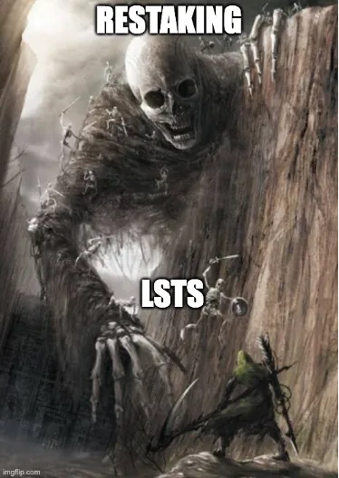

<h1>LST’s, restaking, systemic risks, parasites, greed, and a protocol’s journey to death</h1>

<i>Note: this is the second of a series of four articles on the social slashing of systemic risks. The first article is here.</i>

The dangers of liquid staking tokens (LST’s) and restaking have been written about almost exhaustively, but I’m going to give my own take on it and then link you to a bunch of awesome resources at the bottom if you don’t believe me. Since I’m not a core dev, this analysis should be less technical and more from an economist’s viewpoint about how certain systems trend towards monopolies, suffer from extreme moral hazard as they grow, and will eventually require the system to save them. For information on how they could exacerbate centralization of nodes, MEV, and how size can put them at an economic advantage just with regard to the staking protocol, check out here, or here.

<b>How LST’s work</b>

Biological parasitism is more complex, and precisely for that reason it’s a better and more sophisticated metaphor for economics. The key is how a parasite takes over a host. It has enzymes that numb the host’s nervous system and brain. So if it stings or gets its claws into it, there’s a soporific anesthetic to block the host from realizing that it’s being taken over. Then the parasite sends enzymes into the brain. A parasite cannot take anything from the host unless it takes over the brain. — Michael Hudson [1]

    

The brain of crypto systems is the point at which ultimate security lies: the social layer. It’s slowly co-opted as self-interested individuals seek to maximize yield in a hyper competitive environment. Crypto has little barriers to entry or long term accountability, so money is passed out easily to those with fast plans playing the current narrative. Investors and influencers are biased by their monetary incentives and the social layer turns into an echo chamber of those half heartedly “aligned” with the protocol, all while the original founders and users slowly seem irrelevant.

Enter LST’s.

The idea of liquid staking is that ETH holders send their ETH to a central entity who uses it to stake and run a validator on their behalf. Normally, staked ETH, held by the Ethereum protocol for slashing in case they misbehave, is locked up and no longer transferable. To get around this, the entity running the validators will mint the depositor an equivalent amount of “liquid staking tokens” or “LSTs” (also sometimes called a “liquid staking derivatives” or “LSDs”, but it’s the same thing). There are a lot of benefits to this approach. The main benefit is that more participants can stake. On Ethereum, the minimum stake is 32 Ether (>$70k currently), so it’s a steep price for smaller depositors. With an LST, smaller deposits can go to the LST provider who can bundle them and run validators on their behalf. Additionally, it allows ETH holders who don’t (or can’t) run a validator, to stake and get a return. Finally, since LST’s generate a native yield (e.g. they accrue rewards from the validation their ETH is enabling), this means that if you hold ETH, you get 0%, but if you hold an LST it gets more (currently ~4%). These incentives mean that more people will want to stake and the validator set will grow (more money securing the network).

<b>Sounds cool right?</b>

It is cool, but things start to get weird when a large portion of your validators are now run by a single LST company. By using a centralized actor(CA) to coordinate and issue liquid staking tokens, LSTs are centralizing the Ethereum validator set under some other entity. Even if the entity is a DAO, a non-profit, or even a church, it’s a separate group of individuals who likely will have different goals and governance procedures than the base Ethereum chain.

The risk for centralization is that if one validator controls >~33% of the network, they can go offline and prevent finality on the chain , at >50%, they can control the entire chain going forward and at >66%, they can even reverse the chain’s history. These attack thresholds are well known and the Ethereum docs state multiple times that a social layer (fork) will be needed to intervene to save the chain if the threshold is breached.

To summarize:

    * 33%: delay finality
    * 34%: cause double finality
    * 51%: censorship, control over blockchain future
    * 66%: censorship, control over blockchain future and past [source]

The big question is whether or not an LST will grow too big…

<b>The inevitable oligarch — use as collateral</b>

Moral hazard and network effects exist as soon as these thresholds are approached. Once the idea is had that the Ethereum community would rather fork than let a subset of validators be slashed, you get all sorts of weird incentives.

The most well known example of moral hazard is that in the banking sector. Natural monopolies (or those created by regulation) have an inherent backstop. The FDIC will bail out deposits, fannie and freddie will backstop mortgages, and sallie mae will buy all the student loans. You have private issuance of liabilities and a government guarantee of solvency. This very clearly happened leading up to, and was validated by, the 2008 financial crisis. Banks took very risky bets on mortgages and derivatives and made executives very wealthy in the process. When the gamble went the other direction, they got a bailout. And what did we get from it? Did we fix the parasitic system that caused the crash? Of course not. Short of social embarrassment, there’s zero reason for them to change. In fact by bailing out the banks, the implicit guarantee was solidified and the problem exacerbated.

In Ethereum we have yet to explicitly state a backstop to a concentrated validator, and I doubt we ever will. The entire ecosystem is of course adamant against giving said bailouts, however desperate times lead to unplanned outcomes. No politician alive would have said the banks were too big to fail, but it happened. The truth is that as soon as a CA reaches one of the thresholds outlined above, the odds of a social fork to save the system increases. As those odds go up, the CA appetite for risk increases. As we saw with banks, the executives of the too-big-to-fail (TBTF) companies are incentivized to focus on these short-term profits that can be cycled out of the risky system (i.e. cash out).

And it’s not just the CA themselves. Other related systems want to use the CA even more because of the perceived safety of a backstop. Stablecoins, lending protocols, and other investors all want yield. If they have two choices: the yield from the CA with a backstop (potential fork to save it) or a yield from a smaller competitor with no backstop, the CA wins even if the yield is smaller!

The CA and others defending the current system would claim that there is no moral hazard and we would slash them, however in practice things work differently. We’ve heard firsthand of protocols picking a CA’s yield for this exact reason and as more liquidity flows the CA yield, it will only become more attractive for upcoming projects.

<b>Mo stake, mo problems — restaking

LST’s are but the tip of the iceberg when it comes to parasitic protocols. The larger issue currently facing the Ethereum ecosystem is restaking. Restaking is when ETH stake is rehypothecated to act as stake for other services (e.g da, sequencers, oracles, bridges, etc.).

The issue is twofold for the base chain:

    * centralizes LST’s by locking them up in one protocol

    * Leads to increasing base validator requirements (if restaking validators get 10%, but non-restaking only get 3%, eventually all the non-restaking validators will exit)

    

The threat is very real, however the financial incentives for investors, token traders, and even validators is to roll the dice. It’s the hot topic and the social layer is captured to a large extent.

Validators are incentivized to restake because they get more rewards. In the same way LST’s are attractive as collateral for extra yield, restaking is free extra yield for most validators with extra compute. It will quickly become a race to the bottom as the validators willing to accept the riskiest jobs (highest yield) will earn the most money, thus crowding out investing in just normal staking pools.

In addition, the system faces identical problems to LST’s when confronted with the reality of liquid restaked ETH. Now instead of a collateral that just yields the base LST rate, it yields even more! It’s leveraging up the validator set for more rewards at the cost of more risk. To put it in tradfi terms, its banks placing derivatives on top of mortgages, all with the assumption that the housing market will never go down (or in our case, validators will never get slashed).

<b>Learning from our destiny</b>

If we’re creating systems that are too big to fail, why aren’t we treating it as such? We have to be honest here. If Ethereum would fork to save a CA, we need to treat it like a natural monopoly and limit profits, align it with the community, and keep it under tight control. If you can’t , then the question is why are we giving them money? Let’s just enshrine it and keep the fees ourselves if the system is dependent on it. Why do you have a separate governance token with worse distribution over top of ETH? Just use ETH.

To circle back to the bank analogy, if you don’t regulate it or nationalize it ahead of time, you need to jail the bankers and seize their assets if they incite an economic downturn. You need to slash everything they own and have made to prevent moral hazard. In crypto terms, we need to be ready to burn LST protocols to the ground and shun their founders/ VC’s from ever showing their faces if it blows up and forces a community action to rescue the chain.

<b>Further Material on the dangers of LST’s and restaking:</b>

Ben Eddington on Lido — https://www.youtube.com/watch?v=WcGpHXTepcA

Danny Ryan on Systemic Risks — https://www.youtube.com/watch?v=Y0ddkSa1ZuI

Justin Drake on Restaking — https://www.youtube.com/watch?v=dNJ5Tj2VDUo

Vitalik on overloading consensus — https://vitalik.ca/general/2023/05/21/dont_overload.html

William Starr — https://starrwilliam.medium.com/leveraging-staked-eth-the-good-the-bad-and-the-eigenlayer-a8112fd6b895

My first article on restaking (last year) — https://medium.com/@nfett/eigenlayer-crypto-rehypothecation-and-the-infinite-trust-machine-4e8164845b59

Risk of LST’s in derivatives.- https://eprint.iacr.org/2023/1842

Risk of LSD’s — https://notes.ethereum.org/@djrtwo/risks-of-lsd

End game of restaking/ LST’s — https://dataalways.substack.com/p/endgame-perils-of-restaking

(tons more exist, this is just a subset of my favorites)

Originally Posted here: https://medium.com/@nfett/social-flex-2-dangers-d4701f525d28 