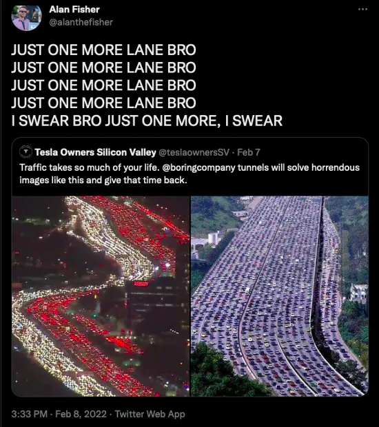
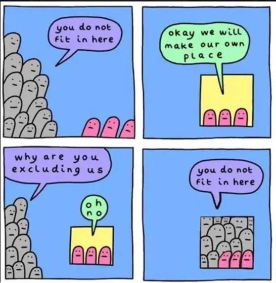

<h1>why values matter –social flexing in crypto</h1>

<i>Note: this is the first of a series of four articles. Next, what are the options for protecting a chain against a systemic risks, what are the outcomes of current systemic risks, and lastly what is the technical feasibility of the options and how could it look.</i>

One of my favorite concepts in economics is the contradiction of “one more lane”. It’s the oft proposed solution to traffic. To the average person, if you see a city that has a traffic problem on its roads, you quickly arrive at the solution: “add more lanes”. It’s pervasive amongst suburban local governments across the nation… “widen I-whatever.”

But it never works out.

Study after study has shown that as you increase lanes and traffic flow, you increase demand at almost the exact same rate. You can never get rid of traffic and even worse, you completely change the footprint and feel of your town.[1]

    

It’s slightly backwards, but it makes sense. If you’re willing to commute 25 minutes to your job, you live the best place you can that will get you to your job on time. If there’s more lanes and you can move further out…you do so for a bigger place. And so do more people. If businesses know they can get deliveries quicker, they do things differently. So that extra lane changes your whole city. Demand moves with supply and the end game of more lanes is a giant sprawling city with long commutes and a car riddled downtown.

Now this isn’t an article about traffic or city planning, but more about defi and crypto. There’s a series of problems in the ecosystem because we’re building things with wrong incentives. We’re building lakes that we know will get overfished. We’re funding companies that we know aren’t sustainable. We’re building parasitic ponzis and derivatives that we know will blow up. We’re not recognizing that humans might be, or might not be, benevolent. We’re hopelessly trying to add lanes.

And some say this is fine. The free market advocates of private roads would argue that if there’s demand, you should allow the market to build more and monetize it. But what if the question about how many lanes to add or where the roads should go….maybe shouldn’t be up to the free market? Maybe it’s a question about what kind of city or town we want to live in? Maybe there’s consequences beyond just “see demand, build product”.

<b>wait, what?</b>

I’ll be honest, this article has to do with crypto and its constant building of things that fly in the face of what we actually want (or wanted) as a group. Namely the recent debates around liquid staking tokens, restaking, and end states of proof-of-stake. Now of course, there are so many other examples of crypto failing to recognize systemic risks or obvious misaligned incentives (derivatives v spot volumes causing pump and dumps, equity v. token incentives leading to VC’s dumping bags on retail, regulatory arbitrage for protected investors with short term liquidity leading to funding founders most likely to break laws….the list is way too long for comfort), but this is about staking and censorship resistance.

<b>capital efficiency, stablecoins and PoS….a race to the bottom</b>

Crypto is the embodiment of hyper-capitalism.

You can create a system and, in a week, or a year, the game theoretical outcome is achieved. Markets with little government influence or border restrictions, natively digital, 24/7, frictionless value transfer makes crypto something that’s unseen in traditional markets. You can see ponzi schemes and gamified systems play out in months with millions of dollars and anonymous participants. It’s beautiful in a way, hell it’s literally our value prop.

But no shocker here, there are down sides.

Hack, after unseen folly, after bank run; mishaps beyond our own comprehension are the rule rather than the exception as ill-fated get rich quick schemes fail to consider or fail to care about the long run outcomes associated with these systems. And of course when we talk folly and mishap, one has no shortage of stories or recollections that come to mind in regard to crypto, but most of these are short term smart contracts..what about the larger systems? If it’s all social consensus at the end of the day, then why can’t we build a system we all feel comfortable using? Does a belief in immutability and censorship resistance mean we have to accept the pieces where they fall?

<b>social upgrading?</b>

As these systems grow larger, how do stakeholders balance upgrade priorities when you have competing interests? If miners want to stay PoW, if validators want increased block sizes, if devs want certain precompiles added in, if a hack steals 90% of your tokens…. Where do you draw the line and what’s allowed in terms of changes to a system?

The common line from the side that benefits from keeping the status quo is that we need to stay “immutable”. No upgrading, but only opt-in moves across to start new chains.[2] I like this in some ways, namely I like thousands of chains better than one, but it still doesn’t address how each chain should behave. Namely, the topic of the day, which is, “can Ethereum use its social layer to minimize systemic risks”?

To briefly explain the situation, if a concentrated actor(CA) controls greater than 33%, they can prevent finality on Ethereum. And if they control greater than 51%, they can do even more malicious things (e.g. cause forks or double spend). The question of the day is whether we should prevent people from reaching those thresholds. Do we have to wait for an attack to fork? Did the market (or community) choose this outcome? Is immutability a value we hold or is it censorship resistance (no one party can censor)…or something(s) else?

<b>social spooning</b>

Crypto has scaled. Despite what people say, we’ve scaled not in one system eating the world but rather by starting thousands. And we’ve done it in the best ways possible, all different approaches. Some ossified protocols like Bitcoin are adamant in their zealousness with regard to forks and others (like some cosmos chains) tend to lean much more on social consensus and almost follow a “move fast and break things” mental model for building a protocol. One isn’t more right. There are tradeoffs as we’ve discussed and as long as you know what system you’re in, you shouldn’t be surprised.

But larger systems evolve. Ethereum has a storied past and has changed since its inception. It has so many vested interests now that the ideals of the past are rightly being questioned to see if they even still matter. And granted maybe they don’t. But anyone around then or that has read Ethereum’s timeline knows they’re not against a fork or an upgrade. The DAO hack in general sort of set precedent early in the community, that consensus would be protected.[3] Even just very recently (mid 2022), the idea of a social slashing was being thrown around to protect tornado cash users against OFAC censoring of validators.[4],[5] There was of course a debate there, but no one questioned that it wasn’t option or that it wasn’t aligned with Ethereum’s values. And for those wondering about the super recent (Nov ‘23), there’s even a whole section about “social coordination” as the last line of defense in Ethereum’s docs[6]. So when talking about a CA, the question isn’t if, it’s whether slashing should be done before or after they start misbehaving.

All said and done, Ethereum has a strong stance that neutrality and censorship resistance will be protected at all costs. Immutability…probably not, but it’s definitely ok to revisit thoughts around this.

    

So doing just that, is the community of today the same as the community as the OG’s of the chains history? Is “Ethereum” the same? As fluid as the term crypto is and even the participants in Ethereum, its not necessarily right to judge the current state by the intentions of the founders.

Like a modern-day ship of Theseus, if all owners change hands, do we follow the same code[7]? Is it the same system? At the very least we should be cognizant of what’s going on, particularly how short-term financial interests in a capturable system can lead to undesired outcomes.

<b>PoS in the real world</b>

ETH isn’t just value. If it was, there’s little future for an asset in a system enabling frictionless value transferal. It actually represents your participation in a system. This is similar to any currency, stock, or asset. They’re built for a reason, and hold value as a byproduct. Like a currency or stock, you should view holding an asset as a signal of something, like you own part of a company, live in a certain area, we’re part of a group, or even thought a certain way. It’s not aiming to become a value accrual metric…it’s aiming to serve the group that created it (or who that group has evolved into).

I see a lot of crypto investors and especially ETH protocols that sort of represent themselves as a “company”. Meaning they like to think that the token is a stock and its job is to extract value back to the shareholders. But this is backwards. We need to think about holding or staking more as that of a being a citizen of a country. Sure there’s a currency, and yes there are GDP metrics. But no one would say that goal of a currency system is to extract value and give it back to currency holders. No one would claim that governments should extract rent or that it’s a good thing to have a massive treasury or revenue. Maybe you want high taxes some places and not others. Maybe you like taxes to disincentivize certain behaviors. Maybe growth isn’t the only objective, but instead sustainability. The goal isn’t monetary; it’s moral and meant to serve the population.

<b>But Nick, I like my current narrative</b>

To be fair, the lack of values is in the practical sense a value itself; an allegiance to the free market, to anarchy in and of itself at some level. “Code is law”, or better yet, “anything you can get away with is law”. Hacks, monopolies, ponzi’s, terrorism, or even parasitic threats to the system itself are all fair game…because freedom?

You keep hearing arguments around how any usage of the social layer at all threatens “credible neutrality”…but what the hell does that mean? What the is neutrality? Sure it threatens the meme, but it feels an awful like one of those “perfect free market” constructions that only exist in textbooks.

All this said, there are limits to the social layer. Are your values given to you by the US regulators? Does your chain fork so much that it incentivizes bad security practices/ system design? Is the social layer so overloaded that validators might as well be a handful of roommates (or an AWS datacenter)? All valid questions and concerns which should be considered carefully before any action.

<b>looking at you miss ohio</b>

So what are our values? The question is do we want to live in an adversarial system or can you use a social layer to make it a little more secure. Even if we don’t care about hacks or the next dao fork…maybe we just want that feeling that we’re in this for something better.

Let’s change the narrative back. Quit thinking that Ethereum or any protocol should be a company that extracts value or acts as an “ultrasound” asset. It was made to create a system that we wanted and built, full stop. The goal of crypto is not hyper-financialization and institutions. Don’t let an allegiance to a mythical free market prevent you from fighting for the something great we have right now. You don’t need that extra lane and you don’t need to accept others building one. What kind of city do you want to live in? There’s no right choice, but there is a choice.

<b>References</b>

[1] Traffic story — https://www.wired.com/2014/06/wuwt-traffic-induced-demand/

[2] On a side note, it usually flies in direct contradiction to their claims that everything should be built under their amazing system…but an attack on system maxis another day.

[3] A big reason for the dao fork was that the attacker would own such a large percentage of ETH supply that it might create problems when we moved to PoS. Little did we know it wouldn’t be for quite some time, but the idea of not allowing one party to control the chain was always there.

[4] https://ercwl.medium.com/the-case-for-social-slashing-59277ff4d9c7

[5] https://www.coindesk.com/tech/2022/10/19/will-censorship-fork-ethereum/

[6] https://ethereum.org/en/developers/docs/consensus-mechanisms/pos/attack-and-defense/#people-the-last-line-of-defense

[7] https://medium.com/s/story/what-is-it-like-to-be-a-bitcoin-56109f3e6753