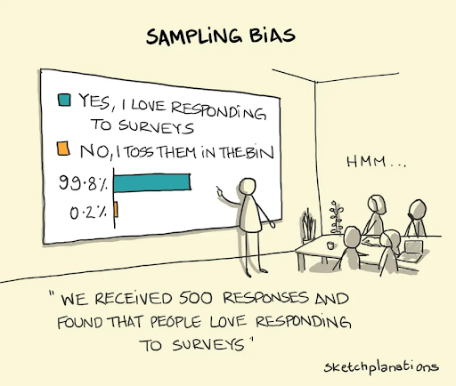

<h1>Prediction Markets as Information Sources</h1>

The news app appears on your holoscreen as you enter the kitchen.  It’s 2036 and we’re in our 5th Trump term, with the last two being his “post body” AI agent.  But that aside, there’s been reports of a major bridge failure on your route into the city.  

Instantly, your phone’s autonomous agent is scanning the markets.  5M ETH is betting on the fact that a major bridge failure happened.  This is all but verified with your own eyes.  But now onto the question you care about…can you get into the city to meet with your team? Your agent spins up a market on how long it will take to get into the city from your exact location.  Almost instantly thousands of bots monitoring traffic are placing their wagers, instantly telling you that the normal 9 minute drive will be delayed by 34 minutes.  You settle the market and decide to push the meeting to another day.  Now onto your sports portfolio…

<b>The goal of prediction markets</b>

For hundreds of years, we’ve known that if you ask people a question, they often answer with what they hope is the answer rather than what they think is the answer.  The same goes with statements of fact.  Often new organizations, social media personalities, or government officials will let you know what they want to be true rather than what is. Anytime a signal could be derived from the statement, there’s a potential for this kind of bias and this is where prediction markets can assist.  Instead of asking for opinions or statements, if you have parties wager on the truth of a given outcome, research has shown that you often get more honest answers, with actual weight behind them. 

Many times called betting markets, prediction markets are more than gambling in that they have a greater aim, namely to reveal information. However, since the information is  an externality of the betting, their usage has been highly regulated due to various factors, namely historical thoughts on gambling and consumer protection laws. For these reasons, the overall blanket ban in the US and limitations in other parts of the world have made them relatively obscure, despite research showing their utility.  

<b>Why not just surveys?</b>

Signalling, Selection, and Noise

If parties think they are signalling with an answer, you often get what a person wants to be true, not what they think has or will actually happen.  For instance, asking someone “who do you think will win the football game?” will often lead to them answering who they would like to win, even if they may not give much hope to their hometown favorite.  Asking them to bet on who they think will win removes this bias if they place more care in losing the economic collateral than in signalling with their prediction. Anonymous surveys and proper question design can help alleviate this problem, but having skin in the game in terms of economic collateral can move the needle even further.

Surveys are also limited by who is being asked the questions. An optional survey tends to get only people who respond to surveys.  A random sample depends on the population you’re sampling from and their expertise or relevance to the question.  A survey of uninformed participants provides no information.  If one were to ask ten people who they think will win a football game, but nine of these individuals have no idea how the game even works, there’s little ability to separate their answer from the one sampled who’s very knowledgeable on the subject.  An open betting market not only allows, but also incentivizes, any expert with an opinion to come to state their prediction with magnitude (i.e. they can bet more) and ideally uninformed participants won’t even take part.  

Lastly, there’s often not just one survey.  As is the case in presidential elections, there’s often tens or even hundreds of surveys with various methodologies and countless special interests funding specific results.  Unless you’re an expert in analyzing survey design and willing to put in the time and effort to understand each claim, competing surveys can be confusing if there’s no way to credibly sort through the noise. 

<b>Game theoretical outcome of prediction markets</b>

To show how prediction markets work and to think through who will likely participate and what the outcome will be, we’ll assume the following categories for potential participants:
  
  * Insiders - those who know for certain and can affect the outcome
  * Informed (risk taker) - e.g. Nate Silver, or other giga-brain that does research and likes to gamble
  * Informed (non-risk taker) - e.g. that same giga-brain if he hates betting
  * Uninformed risk taker - e.g. your average crypto user
  * Uninformed non-risk taker - e.g. your average person that doesn’t gamble

To understand what the informational quality of a prediction market is, we need to answer two questions:

  - Who do we want to participate in the market?
  - Who will participate in the market?

For which participants one wants, first off, we definitely don’t want the insider that knows for sure. He does wonders for the information aspect, but over any repeated game scenario,  he kills the longevity of the platform.  This is literally insider trading; even if you’re a good trader, you’ll always lose money to them. Why would anyone ever bet on a sports game if they know the athletes or refs are betting? 

So, assuming that the first guy is out, next we want informed parties.  Uninformed parties are just opinionate noise.  We want people who have a reason to believe something enough to put money on it, preferably in a fashion that indicates their certainty.  But here’s the catch…do those informed participants disagree on things and are they risk takers? If they are not risk takers, they’re not playing this game unless they’re 100% sure.  Most of these prediction markets we care about aren’t necessarily repeat games, so if they think they might lose their money, they won’t take part.  And we need them to disagree so they can bet against each other too. If you have 30% of experts who believe one thing and 70% believe the alternative, now you have a market.  It makes sense.  But if the experts all agree, you actually need those uninformed people to make up the other side or you have no one betting.  And this is where most prediction markets spend their time: getting uninformed gamblers to lose money to the informed participants.  Just like sports betting platforms, you want those guys throwing money at their home team so you can have some fodder for people actually crunching the numbers and then you get a market.  

But onto who you actually get to participate.  Most of the time, you don’t get anyone.  This is the problem.  If you have an informed risk taker willing to place a bet, you need to get uninformed risk takers to take the other side.  Game theory for the uninformed guys is to not play.  They’re largely guessing so they should stay away in a pure economic sense.  If they stay away however, you’re dependent on disagreements within the informed risk takers subset to make the market and this is where prediction markets have struggled to find product market fit (presidential elections excluded).  

<b>What are the problems of prediction markets</b>

Prediction markets have four main problems that limit their effectiveness or popularity as information tools:
  * Capital efficiency
  * Selection biases and optionality
  * Distributional inequity
  * Market feedback

<i>Capital efficiency</i>

Money is pricey.  Money for a long time is even pricier.  One of the biggest downfalls of current prediction market structure is that capital needs to be locked in them.  If you want to know who will win a football game tomorrow, this isn’t a problem, but if you want to know whether the US is likely to end relations with a foreign country over the next 3 years…well now you’re talking about significant carrying costs for locking up that capital. 
	
<i>Selection Issues</i>

Who shows up to play the game matters.  

    

Open prediction markets like the ones seen in the current crypto ecosystem have a self-selection of participants.  What this means is that you get to choose whether or not you want to play.  If no one’s opinionated but insiders, you have markets where there’s no game to be played. Additionally if there’s no disagreement, there’s no two sides and you don’t even know how certain one side is (they won’t lock up capital for no reason).  You also have a problem where only risky participants play.  If a scenario has a 70% chance of happening, that means you still have a 30% chance of losing money and for some people, this is a no go. Especially in cases where the informed traders may be more risk averse than the uninformed (i.e. one candidate in an election market has all of the gamblers), the market can be skewed by who’s participating. 

<i>Distributional Inequity</i>

A dollar for me is not a dollar for you.

Prediction markets are subject to the distribution of underlying betting assets.  Using betting markets for information assumes that people have equal weights in their beliefs, meaning that conviction is constant for all participants in terms of the betting asset; but this is rarely the case. If we use dollars for instance, there are huge differences in the weight that a party places on a $1,000 bet.  For some, this represents a huge amount of certainty they have in an outcome, but for others it could be very little.  If you have an asset that is not very evenly distributed, this risk is even more so at play (e.g. betting markets in ETH will be subject to the underlying distribution of ETH). Additionally, until there is sufficient liquidity in a market, large holders of the asset can always sway the result if it is used externally.  If I want to signal that an outcome will happen (even if the market is betting against it), some amount of money will get the market to read as I want.  This is mainly a risk for low liquidity markets, but even for larger ones, if I’m willing to lose an amount of money for the purpose of breaking the signal temporarily, the system will have difficulty providing accurate information. 

<i>Market Feedback</i>

Our systems weren’t actually intended to affect the real world. We already know that if large enough, prediction markets can affect the outcome(e.g. sports betting and players throwing the game), but if these systems are used for their information, then too will they affect the system in different ways.  If a market is used to make policy decisions at a federal level, how much will someone pay to throw the market?  If the market is used as an oracle (e.g. the information is a reference price) in a derivatives market, how much would a competing market pay to compromise your market?  These answers actually can’t be known, which is why prediction markets have either relied on centralized intermediaries to ensure results, or in some rare exceptions, allow for forking of the system. 

<b>What do prediction markets work for?</b> 

Some things work well for betting markets, some things work well for surveys, and some things might work well as a mix of both.  Overall the landscape is promising, but thinking about it from a principled perspective, there are some characteristics that make for a good candidate for a prediction market:

<i>Short term questions</i>

This one is due to capital constraints.  Some structures such as parlays, reputation based markets, or leverage can help to mitigate this, but as a general rule, predicting things on a shorter time frame will see the most liquidity and interest and should provide the most useful information. 

<i>Broad array of (strong) opinions by risk takers</i>

To make a market, you need people with different opinions.  If everyone agrees or no one feels strongly on an issue, then no one will gamble.  Additionally, you need a market that is of interest to people who are likely to bet on it.  A market where informed participants are generally non-risk takers (i.e. government workers), may have trouble getting informed participants. 

<i>The market does not affect the outcome</i>

This may be a controversial take, but it’s generally bad for a system long term if there are insiders playing the game.  If you have a sports game and the game is thrown because of the market, that’s generally seen as not a good thing.  If you were a gambler who lost money, you probably won’t play again either; hence for those with insider trading, it may be great for information during this specific market, but for “markets” on the platform, it’s a big net negative. Additionally, markets that aim to affect outcomes (assassination markets, bribes, etc.) are dangerous for other reasons and less about information than openly placing bounties on certain outcomes, something which could be done without a prediction market. 

<b>Conclusion</b>

I’m excited about prediction markets.  I think leveraging permissions, custom reward structures, community token incentives, and even AI will be all part of the experiment.  Freeing information is a noble goal, but we have to realize the challenges and that just building gambling applications won’t deliver on the promise of markets to reveal information.  
