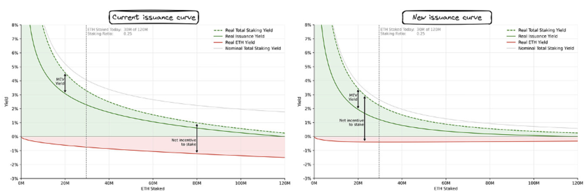

<h1>social slashing our legs off - changing the issuance curve</h1>

tldr - I’m for capping the total amount of ETH staked, but you need to target exogenous rewards directly (LSTs, restaking, exchanges, etc.).  Without doing so we have no control or insight into the true demand curve for staking and the yield curve is largely meaningless unless extreme measures (negative rates) are taken, ones which will likely centralize ethereum in different ways. BUT we should move quickly as those looking to ossify the chain are growing larger.

intro

Recently, an intriguing post was published on endgame staking and another recent proposal calling for targeting the absolute percent of ETH staked. The basic argument is that Ethereum should reduce the base staking reward in an effort to minimize the percent of ETH staked. The main argument is that it keeps ETH and not the LST as "money", not to mention that high amounts of ETH staked is sort of pointless (if everyone gets inflated, no one wins).  I’ll dive further into more arguments, but this piece should portray that although stake targeting is important, unless you target external rewards, the issuance change is likely to just centralize the validator set faster.

why we can’t have nice things - the argument for reward reduction

To summarize the goals of changing the issuance curve, we want to:

reduce total amount staked (high percent staked means the reward is meaningless as everyone gets inflation, so all real rewards are external)

reduce LST/LRT demand - keep ETH as the money + they suck in general

be able to recover from a concentrated validator being slashed

not overpay for security

To expand on how it will work, without restating too much of the other articles, the idea is to make the issuance curve more sensitive to the level of staking participation.  We’d target something like 20% of total ETH staked and then if too many people are staking, the rewards go down and less people will stake.

    

If you have less people staking, then the system makes more sense.  If only 10% of ETH is staked, the other 90% is used as money/gas/collateral.  Since it’s inflationary rewards, you can look at it like the 90% getting their assets devalued to pay the 10%. If the ratios are flipped, it doesn’t make much sense and even pushes those last 10% to stake even more (you’re diluted faster).

Another benefit of a low amount staked is that even if those 10% are owned by 5-10 parties, it theoretically doesn't really matter as much because we can quickly replace them in the event they are slashed and people will be greatly incentivized to do so (rewards are high at low levels of staking).

These are all great goals. I’m on board with all of them. I just disagree that these goals can be targeted successfully solely by issuance curve adjustments.

lsts and ETH #couplegoals

The date is May 2032, and after years of legal battles coinciding with executive leader and supreme court justice Trump abolishing the SEC, a staked ETH ETF is finally approved.  Like other ETF’s, they all use the one centralized exchange left (Coinbase) as a sole custodian of the staked Ether.  Within 2 days of its launch, all of the previous spot ETF’s are converted into this staking ETF and 68% of the ETH supply is now deposited and held with Coinbase for staking.

Although this nightmare scenario seems implausible, it’s quite far from impossible.  If the rate is anything above zero, the scenario here leads to either Coinbase staking themselves or outsourcing to other providers (e.g. RocketPool or Lido). They would either have to self-limit from the goodness of their hearts, or they’d have to play ball.  There is no in-protocol mechanism to prevent this.  You’d be beholden to regulators approving other custodians and tradfi institutions caring about diversifying. This is not a scenario we want to be in.

The truth is that reward curves are different for every party.  Larger parties that have the ability to restake or leverage their validator role get more.  LST’s with massive governance tokens have different thoughts than profitability.  Tradfi institutions with no cost of capital (e.g. a custodian) and regulatory moats make different calculations than solo stakers.

relative vs absolute armageddon - is a small centralized validator set ok?

Let’s assume another extreme scenario: we have only 20% of ETH staked, the issuance rate is -2%, but of our validator set 3% is honest solo stakers and 97% of validators run by one company who runs an LST or a CEX. What do we do if they start censoring?  Let’s say they continue to completely ignore all unregistered defi transactions (it’s a US entity). Sure, you can still get through, but only on 3% of blocks.

What would we do?  What could we do?

The answer is not much.  We could spin up new validators to gain more control, but these would be deeply unprofitable (rates would go further negative with more staked).  So we’d have to rely on social action (something which we haven’t used for the censoring of tornado cash transactions).

Now this could be an option, but unfortunately the validator set is no longer siloed to just those parties; LST’s specifically bleed into other aspects of the chain.  At any positive yield, they’ll be collateral throughout defi.  The centralized entity as well won’t just be “evil centralized entity Inc.”... they’ll have all the same investors as every project on-chain.  They’ll position themselves as “distributed” with a DAO and every other system that rightfully decentralizes themselves.  But it’s still a third party.  They’re not the exact same stakeholders as the base layer and if they get too large (even in percentage terms), a separate set of actors or holders will control the chain.

the effects on going solo

The reason you get solo stakers in a world with low rates is that they love Ethereum.  They have ETH tattoos and undercuts that they show off at hackathons. They run full nodes and are aligned to the core with getting things done.  The problem is that there’s not enough of them to keep the chain running by themselves.

When it comes to staking, you need to pay people at least the basics (how much does it cost to buy the hardware, the electricity, and the capital).  Even for true believers, there are other “aligned” places that you can put your money (e.g. decentralized stablecoins, LP in certain pools, collateral for other crypto economic systems, etc.), so rewards do in some way matter.   If they get too low, you lose the staker.  It’s not hard math.

But unfortunately it is harder math for companies.  What happens when MEV favors certain stakers?  What happens when an LST has a governance token worth $2,000,000,000?  What happens when restaking services offer 15% for validators running a data center?

Many of these companies won’t care if you drop rates to -2%.  They have other yield. So rather than maximizing solo stakers, reward reductions will actually push them out first.  The last man standing will be the validator that has the biggest external yield. And then you’ll be trapped.

If you raise rates a little, the first people who want to stake more are the same people you want out.  All else equal, if you’re targeting the staking rate, you actually force the trade off between issuance and centralization.

Granted the winner at any level of staking is the party with the most efficient use of capital (the long run equilibria), however forcing a change now without addressing the concentrated actors will force centralization faster, not slower.

racing up golgatha - the problem with negative rates

Unfortunately, the staking demand curves for these concentrated actors seem to indicate staking won’t stop without issuance going quite negative.  As this happens, the big question is if we can or even want a base deflationary asset.

I know many parties in the “ultra-sound” money camp will probably love the idea of even more negative issuance, but the truth is that deflationary assets in general can be quite toxic when it comes to the actual utility of the chain.  Who would want to use an asset for gas when you can just hold it?  Who wants to use any of this defi stuff?  You’re not subsidizing users or security, you’re subsidizing holding.

Despite libertarian arguments for a deflationary currency, the truth is that economies often benefit when assets are pushed to circulate.  When you want to spend your money; when you want to invest it in productive assets like companies or people; when you want rates across the board to be lower and products cheaper…the base inflation rate matters.  The question shouldn’t be whether the inflation rate can be negative, it’s whether or not we can use inflationary rewards for something better.  Inflationary rewards in bitcoin and ethereum bootstrapped and increased security.  Inflationary rewards in other systems provide for more just distributions (e.g. public goods funding) or targeted user behaviors (like increased security or usage of certain features).  Having this ability stripped from Ethereum because of external rewards is a negative in more ways than one.

Redistributing MEV rewards to all token holders by burning is one thing, but planning for negative issuance and inflation may have weird consequences in our system and I hope we don’t rush into anything too fast should the current issuance curve proposal fail.

steering boats with spoons - monetary policy and distributional issues

When sybil resistance is a thing, you MUST either have a social layer push more ideal distributions or build the system to not care about distributions (e.g. bitcoin).  As we’ve shown above, distribution does matter in the validator set. 33%, 50%, and 66% are magic numbers that one entity should not control.  So you have to enact some form of social protection around these numbers or the system breaks down.  Being able to thrive above those numbers is also a goal too (if it does get there, being able to work down is a nice property), but the goal needs to be getting under.

Monetary policy tools and issuance curve adjustments are an excellent idea for academia, but reality is more complicated.  If a restaking protocol has 15% rewards on top of staking, anything you do to the base reward is meaningless to their bottom line without severe implications to every other actor.  If a protocol has a $2 billion governance token, the founders and those farming points don’t care if there are any rewards.  They’ll give out inflationary rewards of their own and wreck your chains for years until the whales can exit.  They’ll affect the social layer and pollute the discourse  until even the most fervent decentralization maxi questions whether we ever even had values.

so why maybe now - difficulty bombing it

I’m not opposed to reducing rates.  It’s very possible we’re over paying for security, have too much ETH staked, and of course I hate LST’s with a passion; but you can’t figure out what the demand curve is for staking without addressing external rewards.   If we change the issuance curve prematurely, we’ll likely remove the parties we want to keep and be stuck with more centralization than before.  The only reason I’m for changing any sort of curve is to keep the discussion open.  ETH is not ossified and we should do whatever we can to keep it from being the case.  If we feel like this change is necessary to have more changes next year, then I’m all for it.  Make our intent known that we’ll throw caution to the wind when it comes to stopping the cartelization of the validator set.

I’ve been writing on other options , but just remember we can choose to have an opinion as we figure out new technical solutions.
